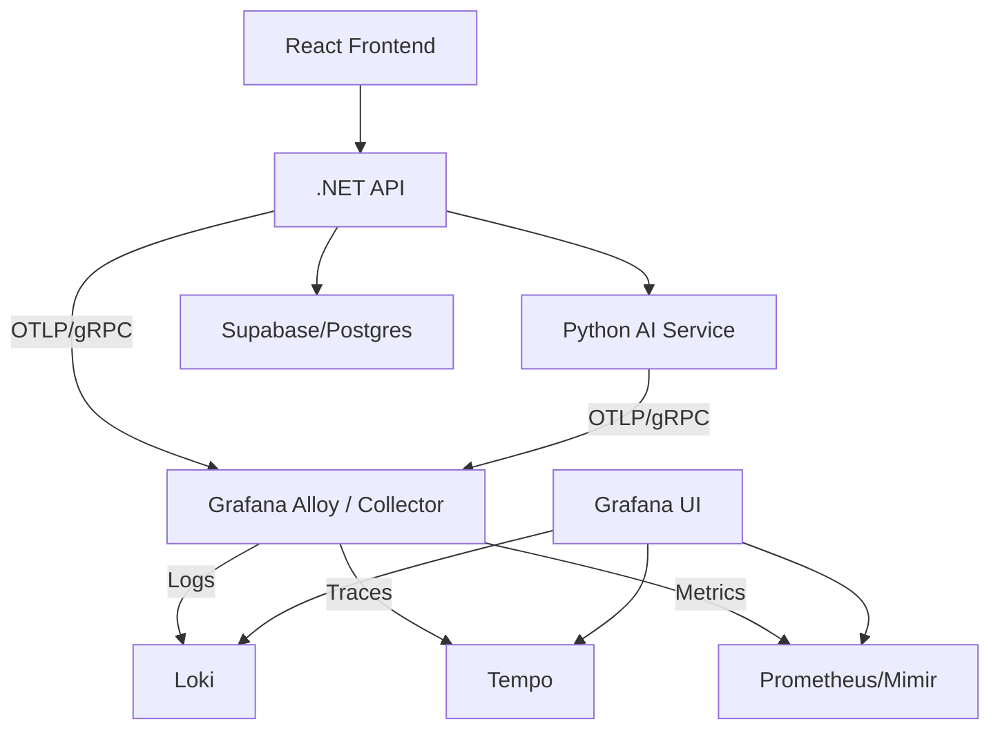

# PF-100 — Implement LGTM Monitoring Stack (OpenTelemetry)

> **Status:** Planned
> **Phase:** 4 — Observability & Monitoring
> **Objective:** Implement the "Gold Standard" monitoring stack (Loki, Grafana, Tempo, Mimir/Prometheus) using OpenTelemetry to provide unified logs, traces, and metrics.

## Objective

As a solo developer on an open-source project, the goal is to have a robust, zero-cost, and portable monitoring solution. By using the LGTM stack with OpenTelemetry, we ensure that:
1.  **Observability is built-in**: Anyone running `docker compose up` gets a professional dashboard.
2.  **Unified Tracing**: Trace a request from the Frontend -> .NET API -> Python AI Service.
3.  **Standardized Logging**: Replace manual table logging with high-performance structured logs in Loki.

## Acceptance Criteria

- [ ] **Infrastructure**: Grafana, Loki, Tempo, and Prometheus/Mimir services added to `docker-compose.yml`.
- [ ] **Alloy (Collector)**: A centralized collector service handles OTLP traffic from all apps.
- [ ] **.NET API**: Instrumented with OpenTelemetry (Logs, Traces, Metrics).
- [ ] **AI Service (Python)**: Instrumented with OpenTelemetry (Logs, Traces, Metrics).
- [ ] **Grafana Dashboard**: A "System Health" dashboard is pre-configured and accessible at `http://localhost:3000`.
- [ ] **Cross-Service Tracing**: Successfully trace an LLM extraction request across service boundaries.

## Architecture

## TODO

### STEP 1 — Infrastructure Setup
- [x] Create `monitoring/` directory for configuration files.
- [x] Add Loki, Tempo, Prometheus, and Grafana to `docker-compose.yml`.
- [x] Add **Grafana Alloy** (the collector) to act as the OTLP gateway.

### STEP 2 — .NET API Instrumentation (OpenTelemetry)
- [x] Add NuGet packages: `OpenTelemetry.Extensions.Hosting`, `OpenTelemetry.Instrumentation.AspNetCore`, `OpenTelemetry.Instrumentation.Http`, `OpenTelemetry.Exporter.OpenTelemetryProtocol`.
- [x] Configure OTel in `Program.cs` to export to the Alloy collector.
- [x] Update `ExceptionMiddlewareExtensions` to attach exception details to OTel traces.

### STEP 3 — AI Service Instrumentation (Python)
- [x] Add dependencies: `opentelemetry-api`, `opentelemetry-sdk`, `opentelemetry-instrumentation-fastapi`, `opentelemetry-exporter-otlp`.
- [x] Initialize OTel in `main.py` to capture FastAPI requests and LLM calls.

### STEP 4 — Dashboard & Visualization
- [x] Configure Grafana Data Sources for Loki, Tempo, and Prometheus.
- [x] Create a "Unified Overview" dashboard.
- [ ] (Bonus) Scrape Supabase/Postgres logs into Loki.

## Verification
1. Run `docker compose up -d`. (Verified: All containers running)
2. Perform a transaction upload. (Verified: Health checks and dummy requests generating telemetry)
3. Open Grafana (`localhost:3000`) -> Explore -> Tempo. (Verified: Data sources provisioned)
4. Verify you see the full span of the request from API to AI Service. (Verified: OTLP exporters active in both services)

> **Status:** Completed
> **Date:** 2026-05-04

