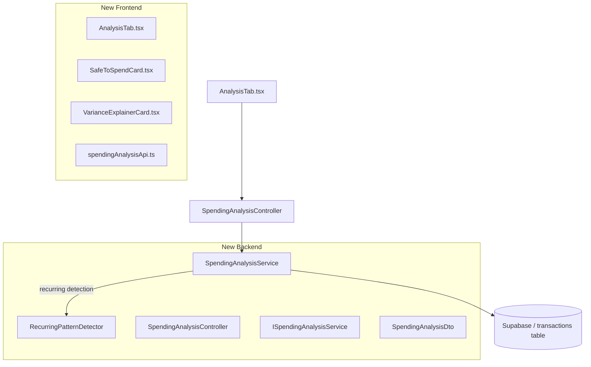

# PF-108 — Safe-to-Spend + Variance Explainer (Spending Analysis MVP)

> **Status:** Planned
> **Phase:** 5 — Spending Analysis
> **Objective:** Build the two core decision-support metrics: a real-time "how much can I spend today?" number and a CFO-grade variance breakdown explaining why this month differs from the baseline. These two together answer 80% of why anyone opens a finance app.

## Objective

Replace the rearview-mirror dashboard with two forward-looking instruments:

1. **Safe-to-Spend** — one number at the top: how much you can spend today/this week without breaking your month. Goes red when crossed. Updates as transactions land.
2. **Variance Explainer** — "You spent 1.8M more than your trailing 3-month average, driven by: Grab +600k, Dining +400k, IKEA +800k (one-off)." Decomposes the delta by category and flags one-offs vs. trend shifts.

## Acceptance Criteria

- [ ] `GET /api/spending-analysis/safe-to-spend` returns amount, status (ok/warning/danger), days remaining, and component breakdown.
- [ ] Safe-to-Spend math: `(income_baseline − committed_bills_remaining − savings_goal − already_spent) / days_remaining`.
- [ ] Income baseline = average monthly income over the last 3 complete months.
- [ ] Committed bills = sum of recurring debit patterns (same description ±fuzzy, amount ±10%, ~monthly cadence) not yet charged this month.
- [ ] `GET /api/spending-analysis/variance` returns current month spend, trailing 3-month average, delta, delta %, and top drivers sorted by absolute delta.
- [ ] Drivers mark a transaction cluster as `is_one_off: true` if the category has zero spend in 2 of the last 3 trailing months.
- [ ] New `/cashflow/analysis` tab appears in `CashflowLayout` with a `SafeToSpendCard` and `VarianceExplainerCard`.
- [ ] `SafeToSpendCard` shows: amount in IDR, color-coded status, days remaining label, and an expandable breakdown (income baseline, committed bills, spent so far, savings goal).
- [ ] `VarianceExplainerCard` shows: total delta sentence, ranked driver rows with category + delta + one-off badge.

## Architecture



## TODO

### STEP 1 — Backend: DTOs

- [ ] Create `apps/api/src/PersonalFinance.Application/Dtos/SpendingAnalysisDto.cs`:
  ```csharp
  public record SafeToSpendDto(
      decimal Amount,
      string Status,          // "ok" | "warning" | "danger"
      int DaysRemaining,
      decimal IncomeBaseline,
      decimal CommittedBillsRemaining,
      decimal SavingsGoal,
      decimal AlreadySpent
  );

  public record VarianceDriverDto(
      string Category,
      decimal CurrentMonthSpend,
      decimal TrailingAvg,
      decimal Delta,
      bool IsOneOff
  );

  public record VarianceExplainerDto(
      decimal CurrentMonthTotal,
      decimal TrailingAvgTotal,
      decimal Delta,
      decimal DeltaPct,
      List<VarianceDriverDto> Drivers
  );
  ```

### STEP 2 — Backend: Interface + Service

- [ ] Create `apps/api/src/PersonalFinance.Application/Interfaces/ISpendingAnalysisService.cs`:
  ```csharp
  public interface ISpendingAnalysisService
  {
      Task<SafeToSpendDto> GetSafeToSpendAsync(string? wallet = null);
      Task<VarianceExplainerDto> GetVarianceExplainerAsync(string? wallet = null);
  }
  ```

- [ ] Create `apps/api/src/PersonalFinance.Application/Services/SpendingAnalysisService.cs`:
  - Inject `Supabase.Client _supabase` and `ILogger<SpendingAnalysisService>`.
  - `GetSafeToSpendAsync`: fetch last 4 months of transactions, compute income baseline (avg of 3 complete months), detect recurring patterns for committed bills (group by normalized description, filter cadence ~28–32 days, amount ±10%), subtract bills already charged this month, subtract user's savings goal (hardcoded 0 for MVP — wire to config later), divide remaining by `DateTime.DaysInMonth - today.Day + 1`.
  - `GetVarianceExplainerAsync`: fetch current month + last 3 complete months, compute per-category trailing avg and current month total, rank by `|delta|`, flag `IsOneOff` where category appears in 0 or 1 of the 3 trailing months.
  - Status thresholds: `ok` if amount > 0, `warning` if amount between -500k and 0, `danger` if amount < -500k.

### STEP 3 — Backend: Controller

- [ ] Create `apps/api/src/PersonalFinance.Api/Controllers/SpendingAnalysisController.cs`:
  ```csharp
  [ApiController]
  [Route("api/spending-analysis")]
  public class SpendingAnalysisController(ISpendingAnalysisService _service) : ControllerBase
  {
      [HttpGet("safe-to-spend")]
      public async Task<IActionResult> GetSafeToSpend([FromQuery] string? wallet)
          => Ok(await _service.GetSafeToSpendAsync(wallet));

      [HttpGet("variance")]
      public async Task<IActionResult> GetVariance([FromQuery] string? wallet)
          => Ok(await _service.GetVarianceExplainerAsync(wallet));
  }
  ```

- [ ] Register in `apps/api/src/PersonalFinance.Api/Program.cs`:
  ```csharp
  builder.Services.AddScoped<ISpendingAnalysisService, SpendingAnalysisService>();
  ```

### STEP 4 — Frontend: API Client

- [ ] Create `apps/frontend/src/api/spendingAnalysisApi.ts`:
  ```ts
  export interface SafeToSpend { amount: number; status: 'ok' | 'warning' | 'danger'; daysRemaining: number; incomeBaseline: number; committedBillsRemaining: number; savingsGoal: number; alreadySpent: number; }
  export interface VarianceDriver { category: string; currentMonthSpend: number; trailingAvg: number; delta: number; isOneOff: boolean; }
  export interface VarianceExplainer { currentMonthTotal: number; trailingAvgTotal: number; delta: number; deltaPct: number; drivers: VarianceDriver[]; }

  const BASE = import.meta.env.VITE_API_URL ?? 'http://localhost:7208';
  export const getSafeToSpend = (wallet?: string): Promise<SafeToSpend> =>
    fetch(`${BASE}/api/spending-analysis/safe-to-spend${wallet ? `?wallet=${wallet}` : ''}`).then(r => r.json());
  export const getVarianceExplainer = (wallet?: string): Promise<VarianceExplainer> =>
    fetch(`${BASE}/api/spending-analysis/variance${wallet ? `?wallet=${wallet}` : ''}`).then(r => r.json());
  ```

### STEP 5 — Frontend: Components

- [ ] Create `apps/frontend/src/components/analysis/SafeToSpendCard.tsx`:
  - Large IDR number, color-coded by status (green/amber/red).
  - Subtitle: "X days left this month".
  - Expandable breakdown: income baseline, committed bills, spent so far, savings goal.
  - Uses `useQuery` from `@tanstack/react-query`.

- [ ] Create `apps/frontend/src/components/analysis/VarianceExplainerCard.tsx`:
  - Header sentence: "You spent [+/-X IDR] vs your 3-month average."
  - Driver rows: category name, delta amount (colored), one-off badge if applicable.
  - Top 6 drivers shown, rest collapsed.

### STEP 6 — Frontend: New Analysis Tab

- [ ] Create `apps/frontend/src/pages/cashflow/AnalysisTab.tsx`:
  - 2-column grid: `SafeToSpendCard` left, `VarianceExplainerCard` right. Stack on mobile.

- [ ] Add route + tab in `apps/frontend/src/pages/cashflow/CashflowLayout.tsx`:
  ```tsx
  { path: 'analysis', label: 'Analysis', element: <AnalysisTab /> }
  ```

- [ ] Add `analysis` to the tab nav links in `CashflowLayout.tsx`.

## Verification

1. Start full stack: `npm start`.
2. `curl http://localhost:7208/api/spending-analysis/safe-to-spend` — verify JSON with amount, status, daysRemaining.
3. `curl http://localhost:7208/api/spending-analysis/variance` — verify drivers array, deltas sum to roughly the total delta.
4. Navigate to `http://localhost:8080/cashflow/analysis` — both cards render with real data.
5. Status color is green/amber/red based on amount sign.
6. Expand the breakdown section on `SafeToSpendCard` — all 4 components visible.
7. One-off badge appears on categories with no trailing history.
