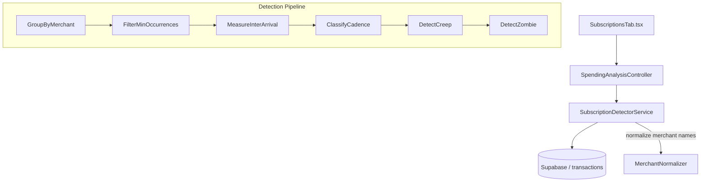

# PF-109 — Subscription & Price-Creep Radar

> **Status:** Planned
> **Phase:** 5 — Spending Analysis
> **Objective:** Auto-detect recurring charges from transaction history, surface the total subscription burden as a % of income, flag price creep, and call out zombie subs — giving the user a single screen that pays for itself the first time they open it.

## Objective

Indonesian users carry many small IDR subscriptions (Spotify, GoPay+, Netflix Mobile, Tokopedia Plus, iCloud) that collectively add up to a brutal number most people have never computed. This feature:

1. **Detects subscriptions** from transaction patterns (same normalized merchant, similar amount ±15%, ~monthly cadence) — zero manual tagging required.
2. **Flags price creep** — "Netflix: 54k → 86k IDR (+59% over 12 months)".
3. **Identifies zombies** — recurring charges not seen in the last 45 days (likely cancelled or changed merchant name).
4. **Shows the math** — total monthly burden, % of income, and "cancel X → save Y/year".

## Acceptance Criteria

- [ ] `GET /api/spending-analysis/subscriptions` returns a list of detected subscription clusters.
- [ ] Each subscription includes: `merchantKey`, `latestAmount`, `firstSeenAmount`, `firstSeenDate`, `cadenceDays`, `monthlyBurden`, `status` (active/zombie/creeping), `creepPct`, `annualCost`, `cancelSavingPerYear`.
- [ ] `GET /api/spending-analysis/subscriptions/summary` returns: total monthly burden, % of income, count by status.
- [ ] Detection algorithm: group transactions by normalized merchant name (lowercase, strip punctuation), filter groups with ≥3 occurrences, median inter-arrival gap 25–35 days = monthly, 6–8 days = weekly, 85–95 days = quarterly.
- [ ] Zombie: latest charge > 45 days ago and group has ≥3 historical charges.
- [ ] Price creep: latest amount > first-seen amount by >5%.
- [ ] New `SubscriptionsTab` (or section within AnalysisTab) renders subscription cards grouped by status.
- [ ] Each card shows merchant, amount, trend badge, and "Cancel → save X/year" CTA.
- [ ] Summary bar at the top shows total burden / monthly income %.

## Architecture



## TODO

### STEP 1 — Backend: DTOs

- [ ] Add to `apps/api/src/PersonalFinance.Application/Dtos/SpendingAnalysisDto.cs`:
  ```csharp
  public record SubscriptionDto(
      string MerchantKey,
      string DisplayName,
      decimal LatestAmount,
      decimal FirstSeenAmount,
      DateTime FirstSeenDate,
      int CadenceDays,              // 30 = monthly, 7 = weekly, 90 = quarterly
      decimal MonthlyBurden,
      string Status,                // "active" | "creeping" | "zombie"
      decimal CreepPct,             // % increase latest vs first-seen
      decimal AnnualCost,
      decimal CancelSavingPerYear
  );

  public record SubscriptionSummaryDto(
      decimal TotalMonthlyBurden,
      decimal IncomeBaseline,
      decimal BurdenPct,
      int ActiveCount,
      int CreepingCount,
      int ZombieCount,
      List<SubscriptionDto> Subscriptions
  );
  ```

### STEP 2 — Backend: Service

- [ ] Create `apps/api/src/PersonalFinance.Application/Interfaces/ISubscriptionDetectorService.cs`:
  ```csharp
  public interface ISubscriptionDetectorService
  {
      Task<SubscriptionSummaryDto> DetectAsync(string? wallet = null);
  }
  ```

- [ ] Create `apps/api/src/PersonalFinance.Application/Services/SubscriptionDetectorService.cs`:
  - Fetch last 13 months of expense transactions.
  - Normalize merchant name: lowercase, strip `"pt "`, `"cv "`, common Indonesian billing suffixes, trim.
  - Group by normalized name. Discard groups with < 3 occurrences.
  - For each group: compute median inter-arrival gap. Classify cadence.
  - Compute `creepPct = (latestAmount - firstSeenAmount) / firstSeenAmount * 100`.
  - Status: zombie if `lastDate < today - 45 days`, creeping if `creepPct > 5`, else active.
  - Compute income baseline from last 3 months avg income (reuse logic from `SpendingAnalysisService`).
  - `MonthlyBurden`: for monthly cadence = latest amount, weekly = latest × 4.33, quarterly = latest / 3.
  - Sort output: creeping first, then zombie, then active. Within each group, sort by monthly burden desc.

### STEP 3 — Backend: Controller

- [ ] Add endpoint to `apps/api/src/PersonalFinance.Api/Controllers/SpendingAnalysisController.cs`:
  ```csharp
  [HttpGet("subscriptions")]
  public async Task<IActionResult> GetSubscriptions([FromQuery] string? wallet)
      => Ok(await _subscriptionService.DetectAsync(wallet));
  ```

- [ ] Register `ISubscriptionDetectorService` → `SubscriptionDetectorService` in `Program.cs`.

### STEP 4 — Frontend: API Client

- [ ] Add to `apps/frontend/src/api/spendingAnalysisApi.ts`:
  ```ts
  export interface Subscription { merchantKey: string; displayName: string; latestAmount: number; firstSeenAmount: number; cadenceDays: number; monthlyBurden: number; status: 'active' | 'creeping' | 'zombie'; creepPct: number; annualCost: number; cancelSavingPerYear: number; }
  export interface SubscriptionSummary { totalMonthlyBurden: number; incomeBaseline: number; burdenPct: number; activeCount: number; creepingCount: number; zombieCount: number; subscriptions: Subscription[]; }

  export const getSubscriptions = (wallet?: string): Promise<SubscriptionSummary> =>
    fetch(`${BASE}/api/spending-analysis/subscriptions${wallet ? `?wallet=${wallet}` : ''}`).then(r => r.json());
  ```

### STEP 5 — Frontend: Components

- [ ] Create `apps/frontend/src/components/analysis/SubscriptionSummaryBar.tsx`:
  - Total monthly burden (large) + % of income pill + status count badges (active/creeping/zombie).

- [ ] Create `apps/frontend/src/components/analysis/SubscriptionCard.tsx`:
  - Merchant name, amount, cadence label ("monthly", "weekly").
  - Creep badge (red upward arrow + % if status === 'creeping').
  - Zombie badge (grey ghost icon if status === 'zombie').
  - "Cancel → save Xjt/year" text in muted color.

- [ ] Create `apps/frontend/src/pages/cashflow/SubscriptionsTab.tsx`:
  - `SubscriptionSummaryBar` at top.
  - Grouped sections: "Price Creep ⚠️", "Zombie Charges 👻", "Active Subscriptions".
  - Each section renders `SubscriptionCard` list.

- [ ] Add `subscriptions` tab to `CashflowLayout.tsx` nav.

## Verification

1. `curl http://localhost:7208/api/spending-analysis/subscriptions`
   - Verify `subscriptions` array is non-empty (expect Spotify, Netflix, etc. if data exists).
   - Verify `burdenPct` is a reasonable number (5–25% range for typical user).
2. Navigate to `/cashflow/subscriptions` — all three section groups render.
3. Price creep badge visible if `creepPct > 5`.
4. Zombie badge visible if `status === 'zombie'`.
5. `cancelSavingPerYear` = `monthlyBurden × 12` — spot-check one merchant.
