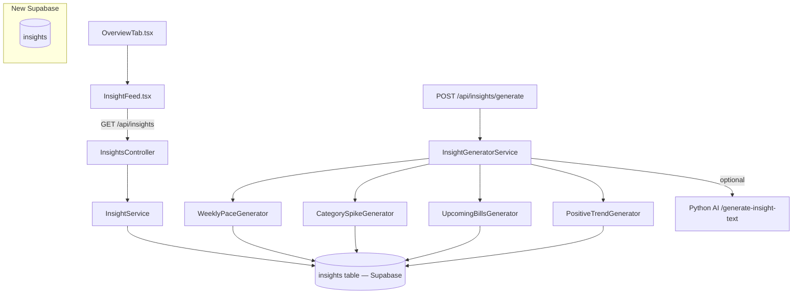

# PF-110 — Insight Cards + Micro-narratives

> **Status:** Planned
> **Phase:** 5 — Spending Analysis
> **Objective:** Build the ambient intelligence backbone: a persistent `insights` table that stores pre-computed insight records, a backend service that generates them (optionally via the live AI service), and a frontend InsightFeed that renders them as sentences — not charts — on the cashflow overview.

## Objective

Charts go in the drill-down. Home screens should read like a smart friend talking to you:

> "You're on track this week. ☕ Coffee spend is 30% above usual — 4 visits to Fore vs your usual 2."
> "Heads up: 3 bills (~5.2M total) hit between Friday and Monday."

The approach is **Insight Cards as backend events** (adopted from Team B's architectural note): insights are pre-computed records in a Supabase table, not calculated on-the-fly in the UI. The frontend fetches a feed and renders cards. The AI service is optional — rule-based generators run first, LLM enrichment is additive.

## Acceptance Criteria

- [ ] Supabase migration creates `insights` table: `id`, `type`, `title`, `body`, `payload_jsonb`, `severity` (info/warning/danger), `is_read`, `created_at`.
- [ ] `POST /api/insights/generate` triggers backend insight generation for the current user's transactions.
- [ ] `GET /api/insights` returns the 20 most recent unread insight cards.
- [ ] `PATCH /api/insights/{id}/read` marks a card read.
- [ ] At minimum, 4 rule-based generators ship: `WeeklyPaceGenerator`, `CategorySpikeGenerator`, `UpcomingBillsGenerator`, `PositiveTrendGenerator`.
- [ ] LLM enrichment is optional: if `AI_INSIGHTS_ENABLED=true`, the Python AI service `POST /generate-insight-text` is called to produce a human-readable `body` sentence. Falls back to template body if AI service unreachable.
- [ ] `InsightFeed` component renders on the cashflow `OverviewTab` above the existing monthly chart.
- [ ] Each insight card: icon + title sentence (bold) + body sentence. Severity tints the left border (blue/amber/red). Dismissible (marks read).
- [ ] Feed refreshes automatically when the user navigates to Overview (stale-while-revalidate via React Query).

## Architecture



## TODO

### STEP 1 — Supabase Migration

- [ ] Create `supabase/migrations/YYYYMMDDHHMMSS_create_insights.sql`:
  ```sql
  create table if not exists insights (
    id          bigserial primary key,
    type        text not null,          -- e.g. 'weekly_pace', 'category_spike'
    title       text not null,
    body        text not null,
    payload     jsonb,
    severity    text not null default 'info',  -- 'info' | 'warning' | 'danger'
    is_read     boolean not null default false,
    created_at  timestamptz not null default now()
  );
  create index on insights (is_read, created_at desc);
  ```
- [ ] Run `supabase db push`.

### STEP 2 — Domain Entity

- [ ] Create `apps/api/src/PersonalFinance.Domain/Entities/Insight.cs`:
  ```csharp
  [Table("insights")]
  public class Insight : BaseModel
  {
      [PrimaryKey("id", shouldInsert: false)] public long Id { get; set; }
      [Column("type")] public string Type { get; set; } = string.Empty;
      [Column("title")] public string Title { get; set; } = string.Empty;
      [Column("body")] public string Body { get; set; } = string.Empty;
      [Column("payload")] public string? Payload { get; set; }
      [Column("severity")] public string Severity { get; set; } = "info";
      [Column("is_read")] public bool IsRead { get; set; }
      [Column("created_at")] public DateTime CreatedAt { get; set; }
  }
  ```

### STEP 3 — DTOs

- [ ] Create `apps/api/src/PersonalFinance.Application/Dtos/InsightDto.cs`:
  ```csharp
  public record InsightDto(long Id, string Type, string Title, string Body, string Severity, bool IsRead, DateTime CreatedAt);
  ```

### STEP 4 — Insight Generators

- [ ] Create `apps/api/src/PersonalFinance.Application/Interfaces/IInsightGenerator.cs`:
  ```csharp
  public interface IInsightGenerator
  {
      string Type { get; }
      Task<IEnumerable<Insight>> GenerateAsync(IList<Transaction> recentTransactions);
  }
  ```

- [ ] Create `apps/api/src/PersonalFinance.Application/Services/Insights/` folder with:
  - `WeeklyPaceGenerator.cs` — compare this week's spend so far vs weekly avg. Title: "On track this week" or "Spending fast this week".
  - `CategorySpikeGenerator.cs` — find categories where current-month spend > trailing-3-month avg by >25%. Title: "Coffee spend 30% above usual".
  - `UpcomingBillsGenerator.cs` — look at recurring patterns from PF-109 logic (reuse `SubscriptionDetectorService`), surface any charges expected in next 5 days. Title: "2 bills (~3.2M) due this weekend".
  - `PositiveTrendGenerator.cs` — if current month expenses < trailing avg by >10%, generate a positive card. Title: "Strong month — spending 12% below average".

### STEP 5 — Insight Service + Controller

- [ ] Create `apps/api/src/PersonalFinance.Application/Interfaces/IInsightService.cs`:
  ```csharp
  public interface IInsightService
  {
      Task GenerateInsightsAsync(string? wallet = null);
      Task<IEnumerable<InsightDto>> GetRecentAsync(int limit = 20);
      Task MarkReadAsync(long id);
  }
  ```

- [ ] Create `apps/api/src/PersonalFinance.Application/Services/InsightService.cs`:
  - `GenerateInsightsAsync`: fetch last 4 months transactions, run all `IInsightGenerator` implementations, delete stale (> 7 days old) unread insights of same type, insert new ones via `supabase.From<Insight>().Insert()`.
  - Optionally call Python AI service `POST /generate-insight-text` with `{ type, payload }` to enrich `body`. Swallow exceptions (fallback to template body).
  - `GetRecentAsync`: `supabase.From<Insight>().Filter("is_read", eq, false).Order("created_at", desc).Limit(limit).Get()`.
  - `MarkReadAsync`: `supabase.From<Insight>().Filter("id", eq, id).Set("is_read", true).Update()`.

- [ ] Create `apps/api/src/PersonalFinance.Api/Controllers/InsightsController.cs`:
  ```csharp
  [ApiController] [Route("api/insights")]
  public class InsightsController(IInsightService _service) : ControllerBase
  {
      [HttpPost("generate")] public async Task<IActionResult> Generate([FromQuery] string? wallet) { await _service.GenerateInsightsAsync(wallet); return Ok(); }
      [HttpGet]              public async Task<IActionResult> Get()    => Ok(await _service.GetRecentAsync());
      [HttpPatch("{id}/read")] public async Task<IActionResult> MarkRead(long id) { await _service.MarkReadAsync(id); return NoContent(); }
  }
  ```

- [ ] Register generators + service in `Program.cs`:
  ```csharp
  builder.Services.AddScoped<IInsightGenerator, WeeklyPaceGenerator>();
  builder.Services.AddScoped<IInsightGenerator, CategorySpikeGenerator>();
  builder.Services.AddScoped<IInsightGenerator, UpcomingBillsGenerator>();
  builder.Services.AddScoped<IInsightGenerator, PositiveTrendGenerator>();
  builder.Services.AddScoped<IInsightService, InsightService>();
  ```

### STEP 6 — Python AI Service (Optional enrichment)

- [ ] Add `POST /generate-insight-text` to `services/ai-service/app/main.py`:
  - Input: `{ type: str, payload: dict }`.
  - Prompt: "Write a single engaging sentence (max 20 words) for a personal finance insight card. Type: {type}. Data: {payload}. Be specific with numbers. IDR currency."
  - Use `claude-haiku-4-5` (cheap, fast — classification-grade task, < 30 tokens output).
  - Returns: `{ body: str }`.

### STEP 7 — Frontend: API Client

- [ ] Add to `apps/frontend/src/api/spendingAnalysisApi.ts`:
  ```ts
  export interface InsightCard { id: number; type: string; title: string; body: string; severity: 'info' | 'warning' | 'danger'; isRead: boolean; createdAt: string; }
  export const getInsights = (): Promise<InsightCard[]> => fetch(`${BASE}/api/insights`).then(r => r.json());
  export const generateInsights = (): Promise<void> => fetch(`${BASE}/api/insights/generate`, { method: 'POST' }).then(() => {});
  export const markInsightRead = (id: number): Promise<void> => fetch(`${BASE}/api/insights/${id}/read`, { method: 'PATCH' }).then(() => {});
  ```

### STEP 8 — Frontend: InsightFeed Component

- [ ] Create `apps/frontend/src/components/analysis/InsightCard.tsx`:
  - Left colored border by severity (blue/amber/red).
  - Icon by type (emoji or lucide icon).
  - Bold title + muted body.
  - Dismiss X button → calls `markInsightRead`, removes from feed.

- [ ] Create `apps/frontend/src/components/analysis/InsightFeed.tsx`:
  - `useQuery(['insights'], getInsights, { staleTime: 5 * 60_000 })`.
  - On mount, fire `generateInsights()` mutation (fire-and-forget, don't await).
  - Renders `InsightCard[]`. If empty: render nothing (no empty state needed — the feed just hides itself).

- [ ] Insert `<InsightFeed />` at the top of `apps/frontend/src/pages/cashflow/OverviewTab.tsx`, above the existing `MonthlyFlowChart`.

## Verification

1. `curl -X POST http://localhost:7208/api/insights/generate` — verify 200.
2. `curl http://localhost:7208/api/insights` — verify array of cards with title, body, severity.
3. Navigate to `/cashflow` (Overview tab) — insight cards appear above the monthly chart.
4. Dismiss a card — it disappears from the feed, verify `is_read=true` in Supabase Studio.
5. Check Supabase Studio `insights` table — rows exist with correct types.
6. (Optional) Set `AI_INSIGHTS_ENABLED=true`, re-generate — verify `body` contains LLM-written text.
