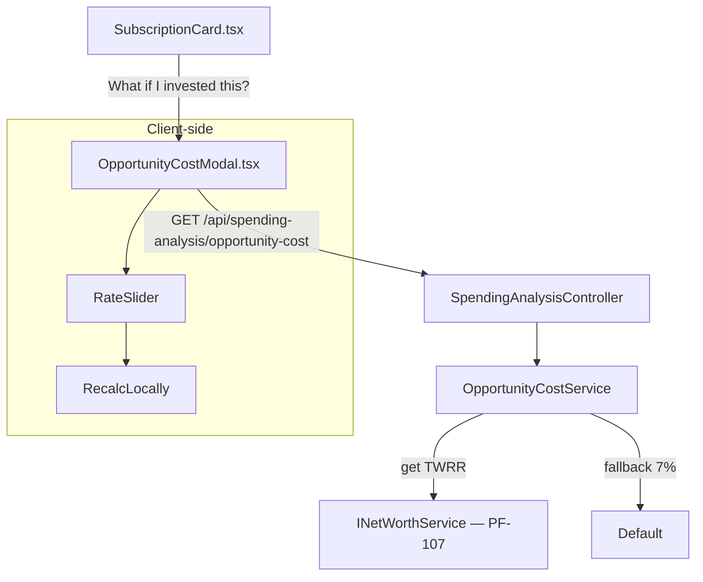

# PF-111 — Opportunity Cost Visualizer

> **Status:** Planned
> **Phase:** 5 — Spending Analysis
> **Objective:** Bridge cashflow → wealth by showing what a recurring "leak" (identified subscription or any user-selected recurring spend) would compound to if redirected into investments. Leverages the live PF-107 Assets Management TWRR/IRR infrastructure as our unique moat.

## Objective

Most apps say "cancel Netflix and save 86k/month." This says "cancel Netflix and save 86k/month — which becomes **1.4M IDR** in 10 years at your portfolio's current 8.2% return."

The key differentiator: we pull the user's *actual* portfolio return rate from the Assets module (PF-107) instead of using a generic "7%" assumption. The visualization bridges the two halves of the app in a way no generic finance tool can credibly do.

This is a modal/slide-in triggered from any subscription card (PF-109) or any recurring spend in the variance explainer (PF-108) — not a standalone page.

## Acceptance Criteria

- [ ] `GET /api/spending-analysis/opportunity-cost?monthlyAmount={X}&years={Y}` returns a projection curve.
- [ ] If the user has portfolio data (PF-107 Assets), the default rate is derived from the latest `net_worth` TWRR calculation. Falls back to 7% if no assets exist.
- [ ] Response includes: `rateUsed`, `rateSource` ("portfolio" | "default"), and a `dataPoints` array of `{ year, projectedValue }` from year 1 to `years`.
- [ ] Formula: `FV = PMT × ((1+r/12)^(n×12) - 1) / (r/12)` (monthly compounding).
- [ ] `OpportunityCostModal` opens from any `SubscriptionCard` via a "What if I invested this?" CTA link.
- [ ] Modal shows: a Recharts line chart of projected wealth, the rate source note ("based on your portfolio return" or "using 7% default"), and key milestone callouts (year 1, year 5, year 10).
- [ ] User can adjust the rate with a slider (6%–15%) and watch the projection update live (client-side recalc, no new API call for slider changes).
- [ ] User can adjust years (5 / 10 / 20 / 30) via segmented control.

## Architecture



## TODO

### STEP 1 — Backend: DTOs

- [ ] Add to `apps/api/src/PersonalFinance.Application/Dtos/SpendingAnalysisDto.cs`:
  ```csharp
  public record OpportunityCostDataPoint(int Year, decimal ProjectedValue);

  public record OpportunityCostDto(
      decimal MonthlyAmount,
      decimal RateUsed,          // decimal e.g. 0.082 = 8.2%
      string RateSource,         // "portfolio" | "default"
      int Years,
      List<OpportunityCostDataPoint> DataPoints
  );
  ```

### STEP 2 — Backend: Service

- [ ] Create `apps/api/src/PersonalFinance.Application/Interfaces/IOpportunityCostService.cs`:
  ```csharp
  public interface IOpportunityCostService
  {
      Task<OpportunityCostDto> ProjectAsync(decimal monthlyAmount, int years = 10);
  }
  ```

- [ ] Create `apps/api/src/PersonalFinance.Application/Services/OpportunityCostService.cs`:
  - Inject `INetWorthService _netWorthService` (from PF-107) and `ILogger<OpportunityCostService>`.
  - Attempt to get TWRR from `_netWorthService.GetTwrrAsync()`. If it returns a value, use it as rate. If null/throws, fall back to `0.07m`.
  - Compute monthly compounding FV for each year 1..N:
    ```csharp
    decimal monthlyRate = annualRate / 12;
    decimal fv = pmt * ((decimal)Math.Pow((double)(1 + monthlyRate), months) - 1) / monthlyRate;
    ```
  - Return `DataPoints` for years 1, 2, 3, 5, 10, 15, 20 (capped at `years` param).

### STEP 3 — Backend: Controller Endpoint

- [ ] Add to `SpendingAnalysisController.cs`:
  ```csharp
  [HttpGet("opportunity-cost")]
  public async Task<IActionResult> GetOpportunityCost(
      [FromQuery] decimal monthlyAmount,
      [FromQuery] int years = 10)
      => Ok(await _opportunityCostService.ProjectAsync(monthlyAmount, years));
  ```

- [ ] Register `IOpportunityCostService` → `OpportunityCostService` in `Program.cs`.

### STEP 4 — Frontend: API Client

- [ ] Add to `apps/frontend/src/api/spendingAnalysisApi.ts`:
  ```ts
  export interface OpCostDataPoint { year: number; projectedValue: number; }
  export interface OpportunityCost { monthlyAmount: number; rateUsed: number; rateSource: 'portfolio' | 'default'; years: number; dataPoints: OpCostDataPoint[]; }

  export const getOpportunityCost = (monthlyAmount: number, years = 10): Promise<OpportunityCost> =>
    fetch(`${BASE}/api/spending-analysis/opportunity-cost?monthlyAmount=${monthlyAmount}&years=${years}`).then(r => r.json());
  ```

### STEP 5 — Frontend: Modal Component

- [ ] Create `apps/frontend/src/components/analysis/OpportunityCostModal.tsx`:
  - Triggered via `open` prop + `monthlyAmount` prop from parent.
  - On mount: `useQuery(['opportunity-cost', monthlyAmount], () => getOpportunityCost(monthlyAmount))`.
  - State: `localRate` (number, initialized from `data.rateUsed`), `localYears` (number, initialized from 10).
  - Client-side recalc function `computeProjection(pmt, rate, years)` using the same FV formula — recomputes `dataPoints` when slider/years control changes (no extra API call).
  - **Rate note**: "Based on your portfolio's X% return" (green pill) or "Using 7% default — add assets to personalize" (grey pill with link to `/assets`).
  - **Recharts `<LineChart>`**: x-axis = year, y-axis = IDR (Jt format), single line with area fill.
  - **Milestone callouts**: render `<ReferenceLine>` at key years with label showing projected value.
  - **Segmented control**: 5 / 10 / 20 / 30 years.
  - **Rate slider**: 6%–15%, step 0.5%.
  - Uses shadcn/ui `Dialog` for the modal shell.

- [ ] Add "What if I invested this?" CTA to `apps/frontend/src/components/analysis/SubscriptionCard.tsx`:
  ```tsx
  <button onClick={() => setOpCostOpen(true)} className="text-xs text-muted-foreground underline">
    What if I invested this?
  </button>
  <OpportunityCostModal open={opCostOpen} onClose={() => setOpCostOpen(false)} monthlyAmount={sub.monthlyBurden} />
  ```

## Verification

1. `curl "http://localhost:7208/api/spending-analysis/opportunity-cost?monthlyAmount=100000&years=10"` — verify `dataPoints` has entries, `rateSource` is either "portfolio" or "default".
2. Open a subscription card → click "What if I invested this?" → modal opens with chart.
3. If assets exist in PF-107: `rateSource === "portfolio"` and the rate pill is green.
4. Move rate slider to 10% → chart updates immediately (no loading spinner).
5. Switch years to 20 → chart extends, final projected value increases.
6. Spot-check FV math: PMT=100k/month, rate=7%, 10 years → should be ≈ 17.4M IDR.
