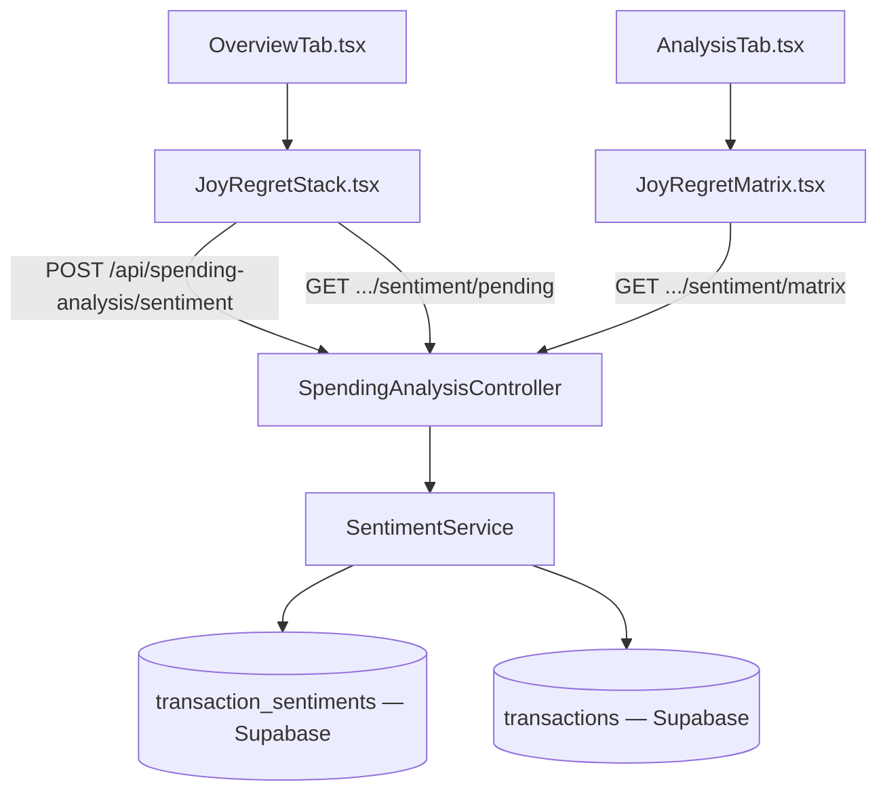

# PF-112 — Joy vs Regret Matrix

> **Status:** Planned
> **Phase:** 5 — Spending Analysis
> **Objective:** Build the screenshot feature — a Tinder-style swipe on discretionary transactions that classifies each as "joy" or "regret", then visualizes spending patterns on a 2×2 value matrix. Reframes the app from accounting tool to behavioral coach.

## Objective

Traditional categories (Dining, Entertainment, Shopping) are functionally useful but emotionally dead. This feature ties spending to *happiness*:

- Each day, the user sees up to 3 discretionary transactions > 50k IDR as swipeable cards.
- Swipe right = joy. Swipe left = regret.
- Over time, a 2×2 quadrant builds up: **High Cost / Low Joy** (the target cuts), **Low Cost / High Joy** (do more of this), **High Cost / High Joy** (indulge mindfully), **Low Cost / Low Joy** (easy wins to eliminate).

This is the feature users will screenshot. The data it produces is also valuable input for the LLM micro-narratives (PF-110).

## Acceptance Criteria

- [ ] Supabase migration creates `transaction_sentiments` table: `transaction_id`, `sentiment` (joy/regret), `created_at`.
- [ ] `GET /api/spending-analysis/sentiment/pending` returns up to 3 unrated discretionary transactions > 50k IDR from the last 14 days, oldest first.
- [ ] `POST /api/spending-analysis/sentiment` accepts `{ transactionId, sentiment }`, inserts or updates the sentiment record.
- [ ] `GET /api/spending-analysis/sentiment/matrix` returns the 2×2 quadrant data: each rated transaction placed in a quadrant based on amount vs the user's median rated amount, and joy/regret.
- [ ] Frontend `JoyRegretStack` renders the swipe card stack (CSS transform-based, not a native gesture library — keep it simple).
- [ ] Right swipe / ✓ button → joy. Left swipe / ✗ button → regret. Up swipe / skip button → skip for today (doesn't remove from pending permanently).
- [ ] After rating, next card slides in. When stack is empty (all 3 done or skipped): show "You're all caught up" state.
- [ ] `JoyRegretMatrix` renders the 2×2 quadrant as a scatter plot (Recharts) on a dedicated section below the swipe stack.
- [ ] Each quadrant has a label and color: top-right = "Worth It" (green), top-left = "Reconsider" (red), bottom-right = "Hidden Gems" (blue), bottom-left = "Easy Cuts" (amber).
- [ ] Swipe stack lives on the cashflow Overview tab (below InsightFeed), visible only when pending cards exist.
- [ ] Matrix lives on the Analysis tab (below Variance Explainer).

## Architecture



## TODO

### STEP 1 — Supabase Migration

- [ ] Create `supabase/migrations/YYYYMMDDHHMMSS_create_transaction_sentiments.sql`:
  ```sql
  create table if not exists transaction_sentiments (
    id              bigserial primary key,
    transaction_id  bigint not null references transactions(id) on delete cascade,
    sentiment       text not null check (sentiment in ('joy', 'regret')),
    created_at      timestamptz not null default now(),
    unique (transaction_id)
  );
  create index on transaction_sentiments (transaction_id);
  ```
- [ ] Run `supabase db push`.

### STEP 2 — Domain Entity

- [ ] Create `apps/api/src/PersonalFinance.Domain/Entities/TransactionSentiment.cs`:
  ```csharp
  [Table("transaction_sentiments")]
  public class TransactionSentiment : BaseModel
  {
      [PrimaryKey("id", shouldInsert: false)] public long Id { get; set; }
      [Column("transaction_id")] public long TransactionId { get; set; }
      [Column("sentiment")] public string Sentiment { get; set; } = string.Empty;
      [Column("created_at")] public DateTime CreatedAt { get; set; }
  }
  ```

### STEP 3 — DTOs

- [ ] Add to `apps/api/src/PersonalFinance.Application/Dtos/SpendingAnalysisDto.cs`:
  ```csharp
  public record PendingSentimentDto(
      int TransactionId,
      DateTime Date,
      string Description,
      string Category,
      decimal AmountIdr
  );

  public record MatrixPointDto(
      int TransactionId,
      string Description,
      decimal AmountIdr,
      string Sentiment,     // "joy" | "regret"
      string Quadrant       // "worth_it" | "reconsider" | "hidden_gems" | "easy_cuts"
  );

  public record SentimentMatrixDto(
      List<MatrixPointDto> Points,
      decimal MedianAmount,
      int JoyCount,
      int RegretCount
  );
  ```

### STEP 4 — Service

- [ ] Create `apps/api/src/PersonalFinance.Application/Interfaces/ISentimentService.cs`:
  ```csharp
  public interface ISentimentService
  {
      Task<IEnumerable<PendingSentimentDto>> GetPendingAsync(string? wallet = null);
      Task RateSentimentAsync(int transactionId, string sentiment);
      Task<SentimentMatrixDto> GetMatrixAsync(string? wallet = null);
  }
  ```

- [ ] Create `apps/api/src/PersonalFinance.Application/Services/SentimentService.cs`:
  - `GetPendingAsync`: fetch last 14 days expense transactions > 50k IDR, excluding any already in `transaction_sentiments`. Order by date asc. Limit 3.
  - `RateSentimentAsync`: upsert into `transaction_sentiments` using `supabase.From<TransactionSentiment>().Upsert()` with `onConflict: "transaction_id"`.
  - `GetMatrixAsync`: fetch all rated transactions + their sentiments. Compute `medianAmount` from the rated set. Quadrant logic:
    - amount > median AND sentiment = joy → `"worth_it"`
    - amount > median AND sentiment = regret → `"reconsider"`
    - amount <= median AND sentiment = joy → `"hidden_gems"`
    - amount <= median AND sentiment = regret → `"easy_cuts"`

### STEP 5 — Controller Endpoints

- [ ] Add to `SpendingAnalysisController.cs`:
  ```csharp
  [HttpGet("sentiment/pending")]
  public async Task<IActionResult> GetPending([FromQuery] string? wallet)
      => Ok(await _sentimentService.GetPendingAsync(wallet));

  [HttpPost("sentiment")]
  public async Task<IActionResult> Rate([FromBody] RateSentimentRequest req)
  {
      await _sentimentService.RateSentimentAsync(req.TransactionId, req.Sentiment);
      return Ok();
  }

  [HttpGet("sentiment/matrix")]
  public async Task<IActionResult> GetMatrix([FromQuery] string? wallet)
      => Ok(await _sentimentService.GetMatrixAsync(wallet));
  ```

- [ ] Add `record RateSentimentRequest(int TransactionId, string Sentiment);` to the DTOs file.
- [ ] Register `ISentimentService` → `SentimentService` in `Program.cs`.

### STEP 6 — Frontend: API Client

- [ ] Add to `apps/frontend/src/api/spendingAnalysisApi.ts`:
  ```ts
  export interface PendingSentiment { transactionId: number; date: string; description: string; category: string; amountIdr: number; }
  export interface MatrixPoint { transactionId: number; description: string; amountIdr: number; sentiment: 'joy' | 'regret'; quadrant: 'worth_it' | 'reconsider' | 'hidden_gems' | 'easy_cuts'; }
  export interface SentimentMatrix { points: MatrixPoint[]; medianAmount: number; joyCount: number; regretCount: number; }

  export const getPendingSentiments = (wallet?: string): Promise<PendingSentiment[]> =>
    fetch(`${BASE}/api/spending-analysis/sentiment/pending${wallet ? `?wallet=${wallet}` : ''}`).then(r => r.json());

  export const rateSentiment = (transactionId: number, sentiment: 'joy' | 'regret'): Promise<void> =>
    fetch(`${BASE}/api/spending-analysis/sentiment`, { method: 'POST', headers: { 'Content-Type': 'application/json' }, body: JSON.stringify({ transactionId, sentiment }) }).then(() => {});

  export const getSentimentMatrix = (wallet?: string): Promise<SentimentMatrix> =>
    fetch(`${BASE}/api/spending-analysis/sentiment/matrix${wallet ? `?wallet=${wallet}` : ''}`).then(r => r.json());
  ```

### STEP 7 — Frontend: Swipe Stack Component

- [ ] Create `apps/frontend/src/components/analysis/JoyRegretStack.tsx`:
  - Fetch `pendingSentiments` via `useQuery`.
  - Show top card. Below the card: two buttons (✗ Regret, ✓ Joy) + Skip link.
  - CSS transition: on rate, animate card sliding left (regret) or right (joy) via `transform: translateX(±120%)` over 300ms, then remove from local state and show next.
  - Drag support: track `mousedown` / `touchstart` → `mousemove` / `touchmove` → apply `transform: translateX(Δpx) rotate(Δpx/20 deg)` in real-time. On release: if |Δ| > 80px, auto-complete the swipe. Else snap back.
  - After rating, call `rateSentiment()` mutation and `queryClient.invalidateQueries(['pending-sentiments'])`.
  - When `pendingSentiments` is empty: render nothing (feed hides itself cleanly).

- [ ] Create `apps/frontend/src/components/analysis/SwipeCard.tsx`:
  - White card, transaction description (truncated), category badge, IDR amount.
  - Rotating joy/regret label overlay appears as the card tilts (green "JOY" right, red "REGRET" left).

### STEP 8 — Frontend: Matrix Visualization

- [ ] Create `apps/frontend/src/components/analysis/JoyRegretMatrix.tsx`:
  - `useQuery(['sentiment-matrix'], getSentimentMatrix)`.
  - Recharts `<ScatterChart>`: x-axis = amountIdr, y-axis = binary (joy=1/regret=0). Add `medianAmount` as a vertical `<ReferenceLine>` splitting left/right.
  - Render a horizontal `<ReferenceLine>` at y=0.5 to split joy/regret.
  - Color points by quadrant: green (worth_it), red (reconsider), blue (hidden_gems), amber (easy_cuts).
  - `<Tooltip>` shows description + amount + sentiment.
  - Quadrant labels rendered as absolute-positioned text overlays.
  - Show joy/regret counts as summary pills above the chart.

### STEP 9 — Wire into Pages

- [ ] Add `<JoyRegretStack />` to `apps/frontend/src/pages/cashflow/OverviewTab.tsx` below `<InsightFeed />`.
- [ ] Add `<JoyRegretMatrix />` to `apps/frontend/src/pages/cashflow/AnalysisTab.tsx` below `<VarianceExplainerCard />`.

## Verification

1. `curl http://localhost:7208/api/spending-analysis/sentiment/pending` — verify up to 3 transactions > 50k IDR.
2. `curl -X POST http://localhost:7208/api/spending-analysis/sentiment -d '{"transactionId":X,"sentiment":"joy"}' -H "Content-Type: application/json"` — verify 200.
3. Navigate to `/cashflow` (Overview) — swipe card appears if pending transactions exist.
4. Swipe a card right → it animates out, next card appears, or "all caught up" state shows.
5. Navigate to `/cashflow/analysis` — matrix scatter plot renders after at least 4 rated transactions.
6. Quadrant labels match point colors (green top-right, red top-left, blue bottom-right, amber bottom-left).
7. Hover a point → tooltip shows description and amount.
8. Confirm in Supabase Studio `transaction_sentiments` table — rows exist with correct sentiment values.
