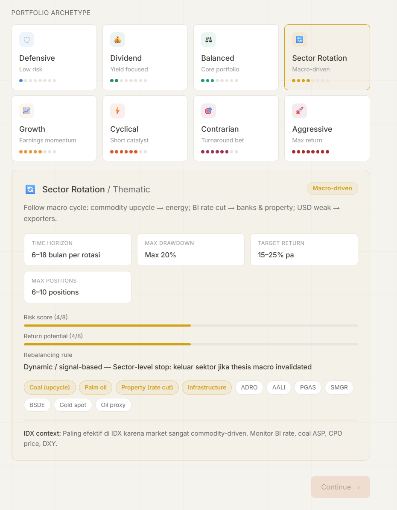

# PortfolioIQ — Comprehensive Build Specification

Build a single-file React artifact named **PortfolioIQ**: an AI-driven multi-asset portfolio review and strategy tool that lets retail investors evaluate their holdings against a chosen portfolio archetype and receive a rigorous structured analysis powered by the AI Model Agent API.



---

## 1. CORE CONCEPT

PortfolioIQ functions as a senior portfolio strategist that analyzes a user's holdings across **any asset class** (equities, bonds, forex, crypto, commodities, REITs, property, cash) against one of 8 strategic archetypes, then produces a comprehensive 7-section review covering diagnostics, holdings evaluation, macro context, scenario modeling, stress testing, a rebalancing decision tree, and a target portfolio recommendation.

Primary audience: retail IDX (Indonesia Stock Exchange) investors with multi-asset exposure, but the framework is generic.

---

## 2. TECH STACK

- **Framework**: React (hooks only, no class components)
- **Format**: Single-file artifact, default export
- **Styling**: Inline styles + top-level `<style>` tag, no Tailwind, no external CSS
- **Charts**: Chart.js loaded from `https://cdnjs.cloudflare.com/ajax/libs/Chart.js/4.4.1/chart.umd.js`
- **Fonts**: Google Fonts Inter (400/500/600) via @import in `<style>`
- **Persistence**: `window.storage` API (Claude artifact sandbox)
- **AI engine**: `fetch("https://api.anthropic.com/v1/messages")` with `max_tokens: 8000`, optional `tools: [{type:"web_search_20250305", name:"web_search"}]`
- **No other dependencies**

---

## 3. AI MODEL SELECTOR (user-switchable, persisted)

Top-right dropdown on Home screen. Selection saved to `window.storage` under key `portfolioiq-model`.

| Model ID | Label | Badge | Color | Description |
|---|---|---|---|---|
| `claude-haiku-4-5-20251001` | Haiku 4.5 | DEV | `#2D8A65` | Fast · Low cost · Good for testing (default) |
| `claude-sonnet-4-6` | Sonnet 4.6 | BALANCED | `#3B8BD4` | Smart · Moderate cost · Production |
| `claude-opus-4-6` | Opus 4.6 | PREMIUM | `#993355` | Most capable · Higher cost · Best analysis |
| `Gemini-flash` | Opus 4.6 | PREMIUM | `#993355` |  Fast |

Dropdown UI: pill button showing badge + label + chevron; click opens panel with all 3 options, each row shows badge pill + label + description + checkmark on selected. Click-outside closes the panel.

---

## 4. PORTFOLIO ARCHETYPES (8 total)

Each archetype includes ALL of these fields:

```
id, label, subtitle, color, glyph (emoji), tagline,
thesis (1–2 sentences, Indonesian-English mixed),
risk (1–8), returnScore (1–8),
timeHorizon, maxDD, targetReturn, maxPositions,
rebalLabel, rebalRule,
primaryTags (4–5 highlighted instrument tags),
secondaryTags (5–8 ghost instrument tags),
idxContext (Indonesian-mixed paragraph with strategic context)
```

**Full archetype data (multi-asset across all):**

1. **Defensive / Capital Preservation** — `#3B8BD4` 🛡 — Low risk, Risk 1/8, Return 1/8, 1–3 tahun, Max 5–8%, 6–10% pa, 8–12 positions, Kuartalan — *"5% per position hard stop, 10% portfolio drawdown = full exit mode"*. Primary: SBN FR series, Big-4 banks, Telco, Gold (PAXG/XAU). Secondary: TLKM, BBCA, BMRI, USD cash, Money market, Deposito. Thesis: "Protect capital first, yield second. Entry hanya di quality names dengan moat kuat." IDX context: "Cocok saat BI rate tinggi & rupiah volatile. TLKM, ICBP, INDF adalah proxy utama di IDX. Combine dengan SBN FR 10Y + USD cash + gold 5–10% untuk stability."

2. **Dividend / Income** — `#2D8A65` 💰 — Yield focused, Risk 2/8, Return 2/8, 3–7 tahun, Max 10–15%, 8–12% pa, 10–15 positions, Semi-annual — *"Sell jika DPS cut >25% YoY atau yield turun di bawah 4%"*. Primary: Big-4 banks, Coal (high FCF), Corporate bonds, REITs/DIRE. Secondary: BBRI, BBCA, BMRI, INDF, ADRO, ORI/SR. Thesis: "Build recurring cash flow via high-yield names. Total return = dividend + coupon + modest cap gain." IDX context: "IDX dividend yield rata-rata 3–5%. BBRI, TLKM, INDF konsisten. Coal names volatile tapi yield tinggi saat harga bagus."

3. **Balanced / Moderate** — `#1D9E75` ⚖ — Core portfolio, Risk 3/8, Return 3/8, 3–5 tahun, Max 15–20%, 10–15% pa, 12–20 positions, Kuartalan — *"7% per position stop, 15% portfolio drawdown = reduce risk-on 50%"*. Primary: Banking, Telco, FMCG, FR bonds, Selective commodity. Secondary: BBCA, TLKM, ICBP, ADRO, ANTM, Gold 5–10%, BTC ≤5%. Thesis: "60/40 multi-asset: 60% quality defensives + 40% growth/cyclical. Survive semua siklus." IDX context: "Strategi paling common untuk retail IDX. Kombinasi bank BUKU IV + 1–2 commodity play + FR bonds 20–30% + gold/BTC kecil sebagai hedge."

4. **Sector Rotation / Thematic** — `#D4A017` 🔄 — Macro-driven, Risk 4/8, Return 4/8, 6–18 bulan per rotasi, Max 20%, 15–25% pa, 6–10 positions, Dynamic/signal-based — *"Sector-level stop: keluar sektor jika thesis macro invalidated"*. Primary: Coal (upcycle), Palm oil, Property (rate cut), Infrastructure. Secondary: ADRO, AALI, PGAS, SMGR, BSDE, Gold spot, Oil proxy. Thesis: "Follow macro cycle: commodity upcycle → energy; BI rate cut → banks & property; USD weak → exporters." IDX context: "Paling efektif di IDX karena market sangat commodity-driven. Monitor BI rate, coal ASP, CPO price, DXY."

5. **Growth / Earnings momentum** — `#E8993A` 📈 — Earnings momentum, Risk 5/8, Return 5/8, 2–5 tahun, Max 25–30%, 15–25% pa, 8–15 positions, Triggered by earnings — *"Sell jika EPS miss >2 quarters berturut-turut atau guidance cut >20%"*. Primary: Digital consumer, Healthcare, Specialty retail, ETH/SOL. Secondary: BREN, EMTK, MAPA, ACES, SIDO, Growth ETF. Thesis: "Beli EPS growth >15% YoY. Hold selama growth story intact. Valuasi secondary." IDX context: "IDX growth names tipis dibanding regional. BREN (nickel), SIDO (herbal) adalah proxy growth lokal terbaik."

6. **Cyclical / Tactical** — `#D85A30` ⚡ — Short catalyst, Risk 6/8, Return 6/8, 1–12 bulan, Max 25–35%, 20–50%+ per catalyst, 4–8 positions, Weekly/event-driven — *"Hard stop 10% per trade. Time stop: keluar jika catalyst tidak materialized dalam 60 hari."* Primary: Coal (Hormuz play), Gold (geopolitical), Construction (APBN), BTC catalyst. Secondary: BUMI, AADI, ENRG, PGAS, WTON, Gold futures, USD/IDR. Thesis: "Ride specific catalysts: election spending, commodity shock, policy announcement. Entry/exit strict." IDX context: "BUMI/AADI Hormuz thesis contoh klasik cyclical IDX. High return, high kejam jika thesis meleset."

7. **Contrarian / Deep Value** — `#993355` 🎯 — Turnaround bet, Risk 6/8, Return 5/8, 1–3 tahun, Unlimited jika salah, 30–100%+ jika benar, 3–6 positions, Minimal — conviction hold — *"Position-level stop berdasarkan thesis invalidation, bukan price"*. Primary: Undervalued SOE, Post-crash commodity, Distressed bonds, BTC bear accumulation. Secondary: BBRI (MSCI delist), ANTM, ELSA, Turnaround kandidat. Thesis: "Beli saat market panic. Harga jauh di bawah intrinsic value + clear catalyst untuk re-rating." IDX context: "Sangat menarik di IDX karena retail-driven panic selling sering berlebihan. Butuh holding nerves kuat."

8. **Aggressive / Momentum** — `#A32D2D` 🚀 — Max return, Risk 8/8, Return 8/8, Minggu hingga bulan, Accept 40%+, 50–200%+ atau -40%, 3–5 positions max, Continuous — *"Trailing stop 8–12%. Keluar paksa jika volume drop >40% dari entry day."* Primary: New listings, Geopolitical hype, Short squeeze, Altcoins, Leveraged FX. Secondary: High-beta IDX, IPO momentum, Thematic hype, Meme coins. Thesis: 'Chase momentum, ride narrative. Masuk cepat, keluar cepat. Tidak ada "too expensive".' IDX context: "Berbahaya di IDX karena likuiditas tipis di small-mid cap. Hanya untuk trader berpengalaman dengan sizing kecil."

---

## 5. STORAGE SCHEMA

```json
Key: "portfolioiq-data"
Value: {
  "version": 1,
  "setups": [
    {
      "id": "uuid",
      "name": "My IDX Portfolio",
      "archetype": "balanced",
      "archetypeLabel": "Balanced",
      "createdAt": "ISO",
      "updatedAt": "ISO",
      "snapshots": [
        {
          "id": "uuid",
          "timestamp": "ISO",
          "label": "April 2026 review",
          "holdings": [HoldingObject],
          "totalValue": 150000000,
          "currency": "IDR",
          "analysis": { /* full Claude JSON response */ },
          "analysisTimestamp": "ISO"
        }
      ]
    }
  ]
}
```

**HoldingObject**: `{id, ticker, name, assetClass, exchange, sector, country, currency, allocationPct, quantity, avgBuyPrice, currentPrice, marketValue, notes}` where `assetClass` ∈ `equity | bond | crypto | forex | commodity | property | cash | other`.

**Model key**: `"portfolioiq-model"` → stores selected model ID string.

---

## 6. SCREENS & NAVIGATION

State-driven navigation, no URLs. Top-level states: `home | wizard | analysis | history`.

### Screen 1: HOME

- Max-width 720px, centered, 80px-padding-top
- Header row: H1 "PortfolioIQ" + subtitle + **ModelSelector** top-right
- Empty state (no setups): centered muted text + single warm CTA "New setup →"
- Populated state: list of setup cards with hover-revealed actions
  - Each card: name (H3) + archetype Pill (glyph + label) + snapshot count + last snapshot date + holdings count
  - Hover reveals: "History" (plain) + "Review ↗" (ghost)
- Floating action button bottom-right when setups exist: "+ New setup" (warm CTA, rounded 999, with shadow)
- Page load animation: header fades, cards stagger in (60ms each)

### Screen 2: WIZARD (3 steps)

Top bar: ← Back (left), 3 progress dots filled left-to-right (center), 50px spacer (right). Cross-fade transition between steps (350ms).

**Step 1 — Identity:**
- Input: Setup name
- Dropdown: Base currency (IDR/USD/SGD/EUR/JPY/AUD/GBP)
- Archetype grid: `repeat(auto-fit, minmax(150px, 1fr))`, each card has:
  - 28×28 colored-bg glyph badge
  - Label (14px, weight 500)
  - Tagline (11px, tertiary)
  - 8 risk dots (filled in archetype color up to `risk` value)
  - Selected: border thickens, subtle bg tint `${color}08`
- **Archetype detail card** (appears below grid when one is selected, archetype-color tinted):
  - Header: glyph + Label / Subtitle + tagline Pill
  - Thesis paragraph
  - 2×2 metric grid: TIME HORIZON / MAX DRAWDOWN / TARGET RETURN / MAX POSITIONS (each in a white card with `#E8E5DF` border)
  - Two score bars (Risk score X/8, Return potential X/8) filled in archetype color, 4px height
  - Rebalancing rule: label + full rule text
  - Tags: primary highlighted (`${color}15` bg, `${color}60` border, color text), secondary ghost (white bg, gray text)
  - IDX context paragraph with top divider (`${color}20`)
- Continue button disabled until name + archetype both set

**Step 2 — Holdings:**
Three tab modes in a pill toggle (Manual / Paste & Extract / CSV Upload):

- **Manual**: editable HTML table with columns Ticker, Name, Class (select), Sector, Alloc%, Qty, Avg Buy, [×]. Ticker uppercase auto-transform, monospace. "+ Add holding" button. Running total allocation at bottom (green if =100%, red if >100%, neutral otherwise).
- **Paste & Extract**: large monospace textarea + "Extract with AI →" warm CTA. On click, calls Claude with extraction system prompt (see §8). On success, populates manual table.
- **CSV Upload**: drag-drop zone with dashed border + "Choose file" label. Fuzzy column mapping on headers (find by includes: 'ticker', 'symbol', 'allocation', 'pct', etc.). Parses with custom regex-based CSV parser supporting `,` or `;` delimiters and quoted fields.

Bottom: summary strip (X holdings / Y asset classes / Z% allocated, color-coded if over).

**Step 3 — Review & run:**
- Read-only holdings table
- Input: Snapshot label (defaults to "Month Year review")
- Input: Total portfolio value (optional, number) + currency dropdown
- Checkbox card: "Include web search for live market data" (default checked) with helper text
- "Run portfolio review →" warm CTA at bottom

### Screen 3: ANALYSIS

**Loading state** (during API call):
- Centered column, max-width 440px
- Header: "ANALYSIS IN PROGRESS" tertiary label + "Reviewing your portfolio" H2
- 5 step list (monospace), each row: status dot + label
  - Steps: "Portfolio data loaded", "Searching live market data..." (or "Loading market context..." if no web search), "Running fundamental analysis...", "Building scenario models...", "Generating action plan..."
  - Schedule: 400ms, 6s, 14s, 24s, 36s — active step pulses, completed turn green with ✓
  - **Final step caps at lastIndex** — never auto-completes all steps (waits for actual API return)
- Bottom tail (with top border):
  - Pulsing dot
  - `ELAPSED · mm:ss` live counter
  - Adaptive hint that shifts: 0–30s "typical runtime 30–60s" → 30–75s "almost there..." → 75–120s "complex portfolio — hang on" → 120s+ "still working. hold tight."

**Output state** (after analysis returns):
- Ghost topbar on hover near top edge: ← Back, setup name, archetype Pill, "Save snapshot" CTA (or ✓ Saved pill)
- Page header: "PORTFOLIO REVIEW · DATE" + setup name H1 + archetype Pill + snapshot label
- Quick metrics row (3 cards): Holdings reviewed / Actions needed (color-coded) / Resilience score (color-coded by threshold)
- 7 collapsible sections, each with:
  - Thin 3×22px accent bar in archetype color
  - `§N` tertiary label (monospace)
  - Section title H3
  - Rotating chevron indicator

**Section breakdown:**

1. **Portfolio Diagnostics**: summary paragraph, doughnut chart (Chart.js) of sector concentration + asset class breakdown bars, inline metrics (concentration risk / diversification score / archetype alignment), numbered key findings list

2. **Holdings Evaluation**: full table with Ticker / Sector / Thesis / Risks / Catalysts / Reco / Confidence columns. Reco column uses colored pills: HOLD (green), REDUCE (amber `#B8860B`), REPLACE (blue `#2867A3`), SELL (red)

3. **Macro & Sentiment Map**: 2-column layout for Global factors + Indonesia factors. Each factor: directional arrow (↑ bullish green / ↓ bearish red / → neutral gray) + factor name + detail. Below: sector winners pills (green) and losers pills (red)

4. **Scenario Modeling**: grid of scenario cards, each with top border colored by `portfolioImpact` (green/red/amber/gray), scenario name + probability pill, description, "YOUR EXPOSURE" callout box, impact label + detail

5. **Portfolio Resilience Test**: SVG semicircle gauge (1–10 score, color-coded ≥7 green / ≥5 amber / <5 red) + rationale paragraph. Stress results table: Scenario / Impact / Fragile holdings (as monospace chips). Two-column footer: Overexposed sectors (red pills) + Missing strategic exposure (amber pills)

6. **Rebalancing Decision Tree**: list of branch cards with IF (archetype-color badge) + THEN (dark badge) format, optional children list with `→` markers under a left border

7. **Recommended Portfolio**: strategy summary paragraph, horizontal Chart.js bar chart (Current `#D4D0C8` vs Target archetype-color), full target allocation table with Ticker / Current / Target / Δ (color-coded) / Action (colored pill: KEEP green / ADD blue / REDUCE amber / EXIT red / NEW teal) / Rationale columns. Numbered priority actions with circular badges. Footer inline metrics: Cash target / Expected return / Time horizon

**Bottom action bar** (fixed, pill-style, max 3–4 actions): Save snapshot (or ✓ Saved), Refine input (5-turn max follow-up chat with Ask button), New snapshot, Home.

**Refine mode**: typing a question and pressing Enter/Ask calls Claude with the analysis JSON as context (truncated to 12000 chars). Responses appear above the action bar as Q/A cards.

### Screen 4: HISTORY

- Setup header with archetype Pill + snapshot count
- If 1+ snapshots selected: orange-highlighted bar with "X/2 selected" + Clear + Compare → buttons
- Snapshot list (sorted newest first): checkbox + label + date + holdings count + total value + 2-line analysis summary preview. Per-row actions: View / Delete (danger style, confirm dialog)

**Compare view** (when 2 snapshots selected):
- Header: "SNAPSHOT COMPARISON" + snap A label → snap B label
- Metrics row: Added (green) / Removed (red) / Common counts
- Full diff table: Status pill (+ ADDED / − REMOVED / COMMON) / Ticker / Alloc A / Alloc B / Δ (color-coded) / Reco A / Reco B

---

## 7. DESIGN CONTRACT (Zen-Mode)

**Color tokens:**
```
canvas: #F5F3EE     (warm canvas with 80px grid texture, 0.018 opacity)
surface: #FFFFFF
surfaceMuted: #FAF8F3
border: #E8E5DF
borderStrong: #D4D0C8
text: #37352F       (warm-black, NOT pure black, weight 500)
textSec: #6B6B6B
textTer: #9B9B9B
warmCTA: #E8C5A8 / hover #DDB794 / text #5C3B1F
pos: #1D9E75       (positive values)
neg: #D85A30       (negative values)
```

**Rules:**
- No persistent sidebar/topbar; ghost topbar only on hover at top edge on Analysis screen
- Single warm CTA per screen at most
- Max-width: 640–720px for forms, 960px for tables/analysis output
- Cards: white surface on warm canvas, 1px `#E8E5DF` border, 12px radius, no shadows except whisper `0 2px 8px rgba(0,0,0,0.06)` on focused inputs
- All numbers/prices in `ui-monospace, Menlo, monospace`
- Typography: Inter (400/500/600), warm-black `#37352F`
- Page transitions: cross-fade + 8px translate, 300ms `cubic-bezier(0.16,1,0.3,1)`
- Page load: staggered fade-in animation, 60ms per element group
- Inputs: 10–14px padding, 8px radius, `#E8E5DF` border, focus glow
- Lists/tables use thin `#E8E5DF` row dividers, no zebra striping
- Mobile-responsive: grid shrinks below 768px, grid texture hidden below 480px

**Animations (CSS keyframes):**
```css
@keyframes fadeSlide { from {opacity:0; transform:translateY(8px);} to {opacity:1; transform:translateY(0);} }
@keyframes pulse { 0%,100% {transform:scale(1); opacity:1;} 50% {transform:scale(1.25); opacity:0.65;} }
```

---

## 8. AI PROMPTS (2 system prompts)

### Extraction prompt (for Paste & Extract tab)

System:
```
You are a financial data extraction engine. Extract structured holding records from any portfolio format. Return ONLY a valid JSON array, no markdown, no explanation. Each object: {"ticker":string|null,"name":string,"assetClass":"equity|bond|crypto|forex|commodity|property|cash|other","exchange":string|null,"sector":string|null,"country":string|null,"currency":string,"allocationPct":number|null,"quantity":number|null,"avgBuyPrice":number|null,"notes":string}. Rules: infer ticker if recognizable; convert "25%"→25; strip currency symbols; IDX stocks likely Indonesian; never fabricate.
```
User message: the raw pasted text.

### Main analysis prompt

System prompt establishes role: "senior portfolio strategist at a top-tier global investment firm specializing in emerging markets, deep expertise in IDX, macroeconomics, sector rotation, and multi-asset portfolio optimization. Direct. Actionable. No generic disclaimers. Investor is analytically sophisticated."

Specifies CRITICAL JSON output schema:
```
{
  "diagnostics": { summary, sectorConcentration[{sector,pct}], assetClassBreakdown[{class,pct}], keyFindings[string], concentrationRisk:"high|medium|low", diversificationScore:1-10, archetypeAlignment },
  "holdingsEvaluation": [{ ticker, sector, thesis, riskFactors, catalysts, recommendation:"HOLD|REDUCE|REPLACE|SELL", confidence:"High|Medium|Low", reasoning, targetWeight }],
  "macroMap": { globalFactors[{factor,impact:"bullish|bearish|neutral",detail}], indonesiaFactors[...], sectorWinners[string], sectorLosers[string] },
  "scenarios": [{ name, probability:"High|Medium|Low", description, sectorWinners[], sectorLosers[], portfolioImpact:"Positive|Negative|Neutral|Mixed", portfolioImpactDetail, yourExposure }],
  "resilienceTest": { overallScore:1-10, scoreRationale, fragileAllocations[{ticker,risk}], overexposedSectors[], missingStrategicSectors[], stressResults[{scenario,impact,fragileHoldings[]}] },
  "decisionTree": { branches: [{condition,action,children:[{condition,action}]}] },
  "recommendedPortfolio": { strategySummary, targetAllocations:[{ticker,name,assetClass,currentPct,targetPct,action:"KEEP|ADD|REDUCE|EXIT|NEW",rationale}], priorityActions:[{priority,action,urgency:"Immediate|Within 1 month|Within 3 months"}], cashTargetPct, expectedReturn, timeHorizon }
}
```

User message template:
```
TARGET ARCHETYPE: {label}
Archetype definition: {full archetype def including thesis, all instruments, IDX context}
Snapshot: {label}
Currency: {currency}
Total value: {formatted}
Date: {today}

HOLDINGS: {markdown table}

INSTRUCTIONS:
1. Evaluate each holding's fit with the {archetype} archetype — multi-asset framework, not stock-only.
2. Portfolio may include equities, bonds, forex, crypto, commodities, REITs, cash — treat each on its merits.
3. {if webSearch} Search for current prices, yields, and news for each holding. {else} Use your knowledge.
4. {if webSearch} Check macro context: BI rate, IHSG, USD/IDR, coal/CPO/gold prices, BTC, US10Y. {else} Reason from general knowledge.
5. Identify the 3 most urgent actions across all asset classes.
6. Build recommended portfolio using the full multi-asset palette for this archetype.
7. Be specific — name tickers, give target %, cite catalysts.

Return ONLY the JSON object.
```

---

## 9. ROBUSTNESS REQUIREMENTS

### Robust JSON parser
Three-layer fallback:
1. Strip markdown fences, try direct `JSON.parse`
2. Use `extractLargestJSON()`: walks character-by-character tracking brace depth, properly handles strings/escapes, extracts the largest balanced `{...}` block (handles leading/trailing prose from web search)
3. If still failing, count unclosed braces and append `}` chars before retrying (handles token-limit truncation)

### Robust API call
- Returns only `type: "text"` blocks from `data.content`
- Web search interleaves `tool_use` and `tool_result` blocks before the final text answer — return the **last** text block (length > 200 chars), else join all text blocks
- Throws on `!response.ok` with status + error body
- Throws on empty/missing content array

### Error states (all rendered as inline, non-blocking screens):
- `API_ERROR`: "Connection error" + error message detail + Try again button
- `PARSE_ERROR`: "Unexpected response format" + expandable `<details>` showing raw response in `<pre>` + Try again button
- `CSV_PARSE_ERROR`: inline "Could not read CSV. Try manual entry tab."
- `EMPTY_PORTFOLIO`: validation blocks proceed in wizard
- `OVER_ALLOCATION`: total in red, warns but doesn't block (user may have partial data)

### Loading UX
- Step indicator caps at `lastIndex` so final step keeps pulsing while API still running
- Live elapsed counter ticks every second
- Adaptive hint message shifts at 30s / 75s / 120s thresholds

### Refine mode
- 5-turn maximum per snapshot
- Each turn passes the full analysis JSON (sliced to 12000 chars) as context to Claude
- Uses default Haiku model for speed regardless of original analysis model

---

## 10. IMPLEMENTATION UTILITIES

Required helpers in the artifact:

```javascript
// UUID v4 generation
const uuid = () => ...

// Date/number formatting
const fmtDate = (iso) => ...  // "Apr 17, 2026"
const fmtNum = (n, decimals) => ...  // locale-formatted

// Storage helpers
async function loadData() // returns {version:1, setups:[]}
async function saveData(d) // returns boolean

// JSON parser
function extractLargestJSON(text)  // brace-depth walker
function safeParseJSON(raw)  // three-layer fallback

// CSV
function parseCSV(text)  // supports , or ; delimiters
function mapCSVRow(row)  // fuzzy column mapping

// API
async function callClaude(systemPrompt, userMessage, useWebSearch, model)

// Chart.js loader
function useChartJS()  // hook that injects CDN script, returns ready flag
```

---

## 11. COMPONENT STRUCTURE

```
App (state: data, screen, setupId, snapId, analysisState, model)
├── ModelSelector (dropdown with persisted choice)
├── Home (setup list, FAB, empty state)
├── Wizard (3 steps with progress dots, archetype detail card)
│   ├── Manual holdings table
│   ├── Paste & Extract (Claude API integration)
│   └── CSV Upload (drag-drop)
├── AnalysisLoading (step indicator + elapsed timer)
├── AnalysisOutput (7 collapsible sections + refine + bottom bar)
│   ├── Section (collapsible accent-bar wrapper)
│   ├── DoughnutChart, BarChart (Chart.js wrappers)
│   ├── FactorCol, ScenCard, Gauge
│   ├── RecoPill, MetricCard, InlineMet, Pill, RiskDots
└── History
    └── CompareView (snapshot diff)
```

Primitives: `Btn` (warm/ghost/plain/danger variants), `Inp`, `Sel`, `Pill`, `RiskDots`, `MetricCard`, `InlineMet`.

---

## 12. FINAL CHECKLIST

- [ ] Single React file with default export
- [ ] All 8 archetypes implemented with full multi-asset instrument tags
- [ ] Model selector with 3 options, persisted, default Haiku 4.5
- [ ] All 4 screens (Home, 3-step Wizard, Analysis loading+output, History+Compare)
- [ ] `window.storage` persistence on every state change
- [ ] Chart.js loaded via CDN, both doughnut + horizontal bar implemented
- [ ] All 3 holding input modes work (Manual, Paste+Extract, CSV)
- [ ] Robust JSON parser handles web search prefix text + truncated responses
- [ ] All 5 error states render gracefully
- [ ] Loading screen pulses + elapsed timer + adaptive hint
- [ ] Ghost topbar on Analysis (hover reveal)
- [ ] All 7 analysis sections with archetype-colored accent bars
- [ ] Bottom action bar with refine input (5-turn max)
- [ ] Snapshot history with 2-way compare diff
- [ ] Zen-mode design tokens applied throughout
- [ ] Mobile-responsive breakpoints (768px, 480px)
- [ ] Inter font + monospace for all numbers
- [ ] Cross-fade transitions + staggered load animations

Build it all in one self-contained file. Production-ready.