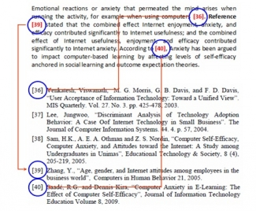

# Glossary RAG (Retrieval-Augmented Generation) — Bahasa Indonesia

> Kumpulan istilah yang muncul selama belajar RAG di learning path ini (PF-AI003, PF-AI004, dan seterusnya). File ini dibuat supaya tidak perlu menjelaskan ulang istilah yang sama di tiap chapter baru — cukup link ke sini. Istilah teknis sengaja dibiarkan Bahasa Inggris (itu yang dipakai di dunia kerja/interview), penjelasannya pakai Bahasa Indonesia sederhana.
>
> Diurutkan per kategori, bukan alfabet, supaya bisa dibaca runtut kalau kamu baru mulai. Kalau cuma mau cari satu istilah, `Ctrl+F` saja. Tiap entri punya anchor id (`#istilah`) supaya bisa di-link langsung dari file lain — lihat daftar id di komentar tiap entri kalau mau nambah link baru.
>
> Dipakai oleh: [PF-AI003-rag-embeddings-retrieval.md](PF-AI003-rag-embeddings-retrieval.md), [PF-AI004-rag-reranking-generation.md](PF-AI004-rag-reranking-generation.md), [PF-AI004-rag-reranking-generation-id.md](PF-AI004-rag-reranking-generation-id.md), [PF-AI005-streaming-sse-todo-id.md](PF-AI005-streaming-sse-todo-id.md).

---

## 1. Dasar: Embedding, Vector, Retrieval

**RAG (Retrieval-Augmented Generation)** — pola di mana LLM tidak menjawab cuma dari "ingatan" hasil training-nya, tapi diberi data nyata yang relevan (hasil pencarian) sebagai konteks tambahan sebelum menjawab. Dua fase: bangun index (sekali) → jawab query (tiap request). Lihat diagram di [PF-AI004-rag-reranking-generation-id.md](PF-AI004-rag-reranking-generation-id.md#konsep-sederhananya).

**Embedding** — representasi teks sebagai deretan angka (vector) yang menangkap makna teks itu. Teks yang maknanya mirip akan punya deretan angka yang "berdekatan" secara matematis. Contoh: `"GOFOOD GEPREK BENSU GADING"` → `[0.021, -0.114, 0.883, ...]` (ribuan angka).

**Vector / Ruang Vektor (vector space)** — "peta" berdimensi banyak tempat semua embedding diletakkan. Jarak antar titik di peta ini dipakai untuk mengukur seberapa mirip dua teks.

**pgvector** — extension PostgreSQL yang menambahkan tipe data `vector` dan operator pencarian jarak (termasuk cosine) langsung di dalam SQL. Dipakai project ini untuk menyimpan embedding transaksi (`transaction_embeddings` table).

**Cosine** — nama sudut (cosine dari sudut) antara dua vector. Dipakai sebagai salah satu cara mengukur "seberapa searah" dua vector di ruang vektor.

**Cosine Similarity** — skor 0–1 (kadang -1 sampai 1) yang menunjukkan seberapa mirip dua vector, dihitung dari cosine sudut di antara keduanya. Skor mendekati 1 = sangat mirip arahnya (maknanya dianggap dekat). Ini metrik utama yang dipakai untuk membandingkan embedding query dengan embedding tiap transaksi.

**Cosine Top-K** — strategi retrieval paling dasar: hitung cosine similarity antara embedding query dan embedding semua kandidat, lalu ambil K hasil dengan skor tertinggi. Ini yang dipakai di Chapter 3 (PF-AI003) sebagai baseline, sebelum ada re-ranking. Kelemahannya: cuma mengandalkan kemiripan angka, tidak benar-benar "membaca" maknanya — lihat [bi-encoder](#bi-encoder) di bawah.

**Top-K** — istilah umum untuk "ambil K hasil teratas" dari hasil yang sudah diurutkan (mis. top-10, top-5, top-3). K-nya angka yang bisa disetel sesuai kebutuhan.

**IVFFlat / `ivfflat.probes`** — algoritma index pgvector yang membagi seluruh data jadi beberapa "cluster" supaya pencarian tidak perlu membandingkan ke semua baris satu-satu (lebih cepat, tapi ada trade-off akurasi). `probes` mengatur berapa banyak cluster yang diperiksa saat pencarian — makin banyak cluster diperiksa, makin akurat tapi makin lambat. Nilai default `probes=1` di project ini pernah jadi bug nyata (cuma memeriksa 1 dari 100 cluster) — lihat bagian Kesalahan Umum di [PF-AI004-rag-reranking-generation-id.md](PF-AI004-rag-reranking-generation-id.md#kesalahan-umum).

---

## 2. Bi-encoder vs Cross-encoder, Re-ranking

**Bi-encoder** — jenis model embedding yang meng-encode query dan dokumen **secara terpisah**, masing-masing jadi satu vector, lalu dibandingkan belakangan (biasanya pakai cosine similarity). Cepat dan bisa di-precompute untuk jutaan dokumen sekaligus — makanya ini yang dipakai untuk retrieval awal (cosine top-K). Kelemahan: karena query dan dokumen tidak pernah "dibaca bersamaan," model ini kadang salah kira dua teks mirip padahal maknanya beda (contoh nyata: "makan" vs "makanan ternak").

**Cross-encoder** — jenis model yang membaca query dan dokumen **bersamaan dalam satu proses**, sehingga bisa benar-benar mempertimbangkan hubungan makna antar keduanya. Jauh lebih akurat dari bi-encoder, tapi jauh lebih lambat — karena tidak bisa di-precompute, cross-encoder cuma dipakai untuk menilai ulang sejumlah kecil kandidat (bukan seluruh database). Ini "juri kedua" di proses re-ranking.

**Re-ranking** — proses menilai ulang urutan hasil pencarian awal (dari bi-encoder) memakai model yang lebih akurat (cross-encoder), supaya hasil yang tadinya "kelihatan mirip" tapi sebenarnya salah bisa disingkirkan dari posisi atas.

**Funnel (corong retrieval)** — pola "ambil banyak dengan cara murah dulu, lalu saring jadi sedikit dengan cara yang lebih mahal/akurat." Contoh di project ini: pgvector top-10 (murah, bi-encoder) → FlashRank top-3 (mahal, cross-encoder). Kalau corongnya terlalu sempit dari awal (misalnya langsung ambil top-5 lalu di-rerank), re-ranking cuma bisa mengurutkan ulang yang itu-itu saja, tidak bisa "menemukan" kandidat baru.

**FlashRank** — library cross-encoder ringan (~34 MB model MiniLM) yang jalan lokal di CPU, tanpa API key, tanpa rate limit, gratis. Dipakai project ini sebagai re-ranker karena bisa dijalankan berkali-kali untuk eval tanpa biaya atau delay jaringan.

**MiniLM** — nama keluarga model bahasa berukuran kecil (dibanding model raksasa seperti GPT). `ms-marco-MiniLM-L-12-v2` adalah salah satu variannya, dilatih khusus untuk tugas re-ranking di Bahasa Inggris (dataset MS MARCO) — makanya kurang cocok untuk query Bahasa Indonesia.

---

## 3. Chunking

**Chunking** — proses memotong teks panjang jadi potongan-potongan (chunk) lebih kecil sebelum di-embed, supaya tiap potongan cukup fokus dan tidak melebihi batas kemampuan model embedding.

**Chunk** — satu potongan hasil chunking. Punya `text` (isi potongan) dan biasanya `index` (posisi di dokumen asli).

**Fixed-size chunking** — cara chunking paling sederhana: potong teks per sekian karakter (misalnya tiap 500 karakter), tanpa peduli isinya. Gampang rusak kalau titik potongnya jatuh di tengah kata/kalimat penting.

**Overlap** — jumlah karakter/teks yang "dibawa" dari akhir satu chunk ke awal chunk berikutnya, supaya informasi yang kebetulan berada tepat di batas potongan tidak hilang sepenuhnya dari kedua chunk.

**Sentence-window chunking** — cara chunking yang memotong berdasarkan struktur kalimat/baris (bukan hitungan karakter), sehingga satu chunk = satu unit yang utuh secara makna (misalnya satu baris transaksi lengkap).

**Window** — pada sentence-window chunking, ini adalah konteks tambahan (±N kalimat/baris tetangga) yang dibawa bersama chunk inti. Prinsipnya: chunk yang **kecil** dipakai untuk pencarian (presisi), chunk yang **diperluas dengan window** dipakai untuk dikirim ke LLM (konteks cukup). Sering disingkat: *"small-to-search, big-to-read"* / "kecil untuk dicari, besar untuk dibaca."

**Semantic chunking** (belum diimplementasikan di chapter ini, baru teaser) — cara chunking yang memotong teks di titik di mana **makna** berubah (dibandingkan dengan sentence-window yang memotong berdasarkan struktur kalimat/baris saja). Caranya: bandingkan embedding similarity antar kalimat yang bersebelahan, potong kalau similarity-nya turun drastis.

**Agentic chunking** (belum diimplementasikan, teaser) — versi chunking yang lebih canggih lagi, biasanya melibatkan LLM untuk memutuskan sendiri di mana titik potong yang paling masuk akal, bukan cuma aturan statistik.

---

## 4. Grounded Generation & Citations

**Grounded generation** — cara membuat LLM menjawab **hanya** berdasarkan data/konteks yang benar-benar diberikan kepadanya, bukan dari "ingatan" hasil training-nya. Lawannya adalah jawaban yang "mengambang" / tidak berbasis data nyata.

**Grounding prompt** — instruksi eksplisit yang ditulis di system prompt untuk memaksa LLM tetap grounded, misalnya: "jawab hanya dari konteks yang diberikan," "kalau tidak tahu, katakan tidak tahu," "jangan menaksir angka."

**Hallucination (halusinasi)** — ketika LLM menghasilkan informasi yang kedengarannya meyakinkan tapi sebenarnya tidak berdasar pada data yang diberikan — bisa berupa angka yang salah, atau menyebut sesuatu (misalnya id transaksi) yang sebenarnya tidak pernah ada di konteks.

**Citations (sitasi)** — rujukan eksplisit dari sebuah klaim di jawaban LLM ke sumber data aslinya (di project ini: `transaction_id` tertentu). Biasanya ditandai dengan angka seperti `[1]`, `[2]` di teks jawaban, lalu dijabarkan di field `citations` sebagai data terstruktur.

**Hallucination guard** — langkah validasi setelah LLM menjawab: setiap id yang disitasi LLM dicek ulang terhadap kumpulan id yang benar-benar ada di konteks yang dikirim. Kalau ada id yang tidak ditemukan (berarti dikarang LLM), id itu dibuang dan dicatat di log sebelum jawaban dikirim ke user.

**Confident flag** — field boolean (`true`/`false`) di response yang menandakan apakah LLM yakin jawabannya benar-benar didukung data. Dibuat sebagai boolean (bukan teks bebas) supaya program bisa langsung mengambil keputusan (misalnya menampilkan pesan "data tidak ditemukan" ke user) tanpa harus mem-parsing kalimat.

---

## 5. Evaluasi (Mengukur Seberapa Bagus Sistemnya)

**MRR (Mean Reciprocal Rank)** — metrik untuk menilai retrieval: untuk tiap query, lihat di posisi (rank) berapa hasil yang benar pertama kali muncul, lalu ambil 1/posisi (reciprocal rank). Rata-ratakan nilai ini dari semua query uji → itulah MRR. Rank 1 → skor 1.0 (sempurna), rank 2 → 0.5, rank 3 → 0.33, tidak ketemu sama sekali → 0.

**MRR@5** — MRR yang dihitung dengan hanya melihat 5 hasil teratas (posisi di luar top-5 dianggap "tidak ketemu").

**P@5 (Precision@5)** — dari 5 hasil teratas, berapa persen yang benar-benar relevan. Beda dengan MRR yang cuma peduli hasil relevan **pertama**, P@5 peduli **semua** slot di top-5 — jadi bisa menangkap kasus di mana hasil pertama sudah benar tapi hasil ke-2 sampai ke-5 banyak yang meleset (noise).

**Reciprocal Rank** — komponen dasar dari MRR: `1 ÷ posisi hasil relevan pertama` untuk satu query tunggal (sebelum dirata-ratakan jadi MRR).

**RAGAS** — library evaluasi khusus RAG yang punya beberapa metrik siap pakai, salah satunya [Faithfulness](#faithfulness).

**Faithfulness** — metrik yang mengukur seberapa "jujur" jawaban LLM terhadap konteks yang diberikan. Caranya: jawaban dipecah jadi klaim-klaim kecil, lalu tiap klaim dicek satu-satu apakah benar-benar didukung oleh konteks yang diambil. Skor 0–1, makin tinggi makin sedikit klaim yang "mengarang." Beda dengan MRR (yang menilai retrieval), faithfulness menilai kualitas **generation**-nya.

**Judge model (LLM-as-judge)** — LLM terpisah yang tugasnya menilai output dari LLM lain (bukan menjawab user secara langsung), dipakai untuk metrik seperti faithfulness.

**Self-preference bias** — kecenderungan sebuah model memberi skor lebih bagus pada jawaban yang dihasilkan oleh dirinya sendiri (atau model yang mirip) dibanding jawaban dari model lain — bahkan kalau kualitasnya sebenarnya sama. Ini alasan kenapa judge model sebaiknya berbeda dari model generator.

**Cross-provider judge** — praktik memakai judge model dari provider yang berbeda dari model generator (contoh di project ini: generator pakai Gemini, judge pakai `gpt-4o-mini` dari OpenAI) untuk menghindari self-preference bias.

---

## 6. Streaming & SSE

**Streaming (token streaming)** — mengirim jawaban LLM ke client potongan demi potongan (token demi token) begitu model menghasilkannya, bukan menunggu jawaban lengkap. Total durasi generation tidak berubah — yang berubah adalah [perceived latency](#ttft): user melihat kata pertama dalam ratusan milidetik, bukan menatap spinner beberapa detik.

**TTFT (Time To First Token)** — waktu dari request dikirim sampai potongan teks *pertama* tampil di client. Metrik utama yang membenarkan streaming: `/ask` blocking baru menampilkan apa pun setelah 2–6s; `/ask/stream` menargetkan TTFT ~150ms.

**SSE (Server-Sent Events)** — satu response HTTP yang dibiarkan terbuka dan terus ditulisi server, sehingga server bisa mendorong banyak "event" kecil ke browser tanpa client bertanya ulang. Unidirectional (server → client saja), jalan di HTTP biasa (tanpa upgrade protokol), dan browser otomatis reconnect kalau putus. Dua aturan protokol yang sering menggigit: content type harus persis `text/event-stream`, dan tiap event diakhiri dua newline (`\n\n`).

**WebSocket** — kanal komunikasi **dua arah** (client dan server sama-sama bisa mengirim kapan saja) di atas koneksi yang di-upgrade dari HTTP. Tepat untuk chat room, multiplayer, collaborative editing. Untuk pola "client kirim satu query, server balas aliran token", dua-arah cuma overhead — [SSE](#sse) lebih pas.

**EventSource** — API bawaan browser untuk konsumsi SSE. Keterbatasan kritisnya: **GET-only** — tidak bisa mengirim POST body atau custom header, jadi tidak bisa memulai request chat yang butuh JSON body.

**`@microsoft/fetch-event-source`** — library yang membungkus `fetch()` (bukan `EventSource`) untuk konsumsi SSE, jadi mendukung POST body, custom header, dan `AbortController`. Footgun-nya: dia menganggap koneksi yang ditutup server sebagai kondisi retry — tanpa `abort()` setelah event `done` (dan `throw` di `onclose`/`onerror`), dia diam-diam reconnect dan **mengirim ulang POST** (generation LLM dobel).

**AbortController** — mekanisme standar browser untuk membatalkan request `fetch` yang sedang berjalan lewat `controller.abort()`. Di chapter streaming dipakai dua arah: tombol Stop user, dan mematikan koneksi setelah `done` supaya library SSE tidak reconnect.

**Async generator** — fungsi `async def` yang memakai `yield` alih-alih `return`: tiap `yield` menyerahkan satu potongan ke pemanggil (yang iterasi dengan `async for`) sebelum fungsi lanjut. Ini yang memungkinkan provider LLM "mengantar tiap piring begitu matang" alih-alih menunggu semua selesai. Type-nya `AsyncGenerator[str, None]`. Jangan di-`await` — panggilannya langsung mengembalikan generator untuk `async for`.

**Event loop** — "pelayan tunggal" di jantung asyncio/FastAPI yang bergiliran melayani semua request secara concurrent. Selama tidak ada yang menyanderanya, satu proses bisa melayani banyak request sekaligus.

**Blocking call** — panggilan sinkron yang tidak kembali sampai kerjaannya selesai (misalnya panggilan LLM sinkron 5 detik). Kalau dijalankan di dalam `async def` tanpa perlindungan, dia membekukan seluruh [event loop](#event-loop) — semua request lain ikut macet. Membungkusnya di `async def` **tidak** membuatnya non-blocking.

**`asyncio.to_thread()`** — memindahkan sebuah blocking call ke worker thread supaya event loop tetap bebas. Fallback saat SDK tidak punya API async asli — untuk streaming, ini kehilangan sifat inkremental (teks tetap datang sekaligus), tapi setidaknya tidak menyandera request lain.

**Buffering (pada streaming)** — lapisan di antara server dan browser (reverse proxy, stdout Python, library versi lama) yang menahan output dan mengirimkannya sekaligus di akhir — merusak streaming tanpa error. Verifikasi dengan `curl -N --no-buffer`: token harus datang progresif. Cek: `proxy_buffering off`, `PYTHONUNBUFFERED=1`, `sse-starlette>=2.1`.

**Langfuse** — platform observability khusus LLM yang dipakai project ini sejak PF-AI001: tiap panggilan LLM dicatat sebagai "generation" dengan token usage, biaya, dan latency. Instrumentasinya *manual per method* — method provider baru (seperti `stream_generate()`) tidak otomatis ke-trace; tanpa span sendiri, panggilannya lenyap diam-diam dari dashboard biaya.

---

## 7. Realtime & Push vs Polling

**Polling** — client bertanya berulang ke server ("ada yang baru?") pada interval tetap, misalnya tiap 2 detik. Sederhana, tapi boros: hampir semua request menjawab "tidak ada perubahan", dan data tetap bisa telat maksimal satu interval. Lawannya adalah **push** — server yang memberi tahu client saat ada perubahan.

**Supabase Realtime** — layanan Supabase yang meneruskan perubahan database Postgres ke client lewat WebSocket: subscribe sekali ke sebuah tabel, dan tiap baris yang di-commit didorong ke client dalam ~50ms — tanpa loop polling. Dua prasyarat independen yang gagal *tanpa error*: tabel harus ada di [publication](#publication) `supabase_realtime`, dan [RLS](#rls) harus mengizinkan role subscriber membaca barisnya.

**`postgres_changes`** — jenis channel Supabase Realtime untuk menerima event perubahan tabel (INSERT / UPDATE / DELETE), difilter per schema + tabel (+ opsional filter kolom). Payload event membawa baris barunya (`payload.new`).

**Publication (Postgres)** — daftar tabel yang perubahannya di-broadcast Postgres lewat logical replication. Supabase Realtime hanya meneruskan tabel yang terdaftar di publication `supabase_realtime` — tabel yang tidak terdaftar tidak pernah disiarkan, tanpa error apa pun. Ditambahkan lewat migration: `alter publication supabase_realtime add table public.transactions;`.

**RLS (Row Level Security)** — fitur Postgres yang memfilter baris per role/user lewat policy (`USING (...)`). Untuk Realtime: event yang barisnya tidak boleh di-`SELECT` oleh role subscriber **dibuang diam-diam** — channel tetap SUBSCRIBED, tapi nol event. Lokal: policy permisif `USING (true)`; production (PF-S08): menyempit ke pemilik terautentikasi, dan "diam"-nya justru jadi perilaku yang benar.

**Debounce** — menunda dan menggabungkan banyak trigger yang datang berdekatan jadi satu aksi. Di chapter ini: satu commit statement meng-insert puluhan baris → puluhan event Realtime → tanpa debounce berarti puluhan refetch; dengan debounce 1 detik, cukup satu toast + satu query invalidation.

---

## Cara pakai glossary ini

Kalau kamu baca chapter baru dan ketemu istilah yang belum familiar:
1. Cek dulu apakah istilahnya dijelaskan langsung di tempat dia muncul (chapter-chapter ini sengaja menjelaskan istilah baru "on the wall" — pas kamu baru butuh, bukan di awal).
2. Kalau butuh pengingat cepat tanpa scroll ke atas, klik link istilahnya (kalau sudah di-link) atau cek file ini langsung.
3. Kalau nemu istilah baru yang belum ada di sini, tambahkan ke kategori yang paling cocok — jangan bikin file glossary baru per chapter. Pakai format `**Nama Istilah** — definisi.` supaya bisa di-link dari file lain.
