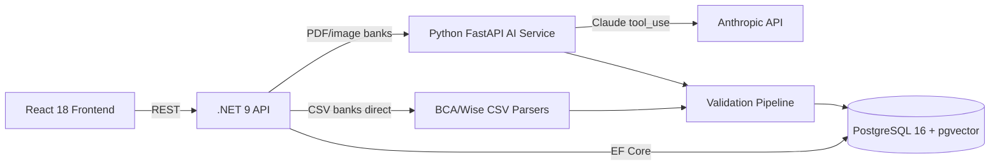

# Overview

Personal Finance is a full-stack monorepo for managing and analyzing personal financial transactions from 5 Indonesian bank accounts. It features a React 18 + Vite frontend, a .NET 9 Clean Architecture API, a Python FastAPI AI service for LLM-powered bank statement extraction, and PostgreSQL 16 with pgvector.

**Monorepo layout:**

```
apps/
  frontend/               # React 18 + Vite + TypeScript (port 8080)
    src/
      api/                # fetch-based API clients
      components/         # Business components + ui/ (shadcn/ui — DO NOT EDIT)
      pages/              # Route views
      types/              # TypeScript interfaces
  api/                    # .NET 9 Clean Architecture API (port 7208)
    src/
      PersonalFinance.Api/           # Controllers, middleware, Program.cs
      PersonalFinance.Application/   # Commands, handlers, validators, services, DTOs
      PersonalFinance.Domain/        # Entities, domain events (zero external deps)
      PersonalFinance.Infrastructure/# Bank parsers, external service clients
      PersonalFinance.Persistence/   # EF Core DbContext, migrations
    tests/PersonalFinance.Tests/     # xUnit + Moq tests
services/
  ai-service/             # Python FastAPI AI service (port 8000)
    app/
      main.py             # FastAPI app entry point
      routers/            # POST /extract/pdf, POST /extract/image
      services/           # LLM extractor (Claude tool_use)
      models/             # Pydantic models (TransactionResult, etc.)
      prompts/            # Bank-specific prompt templates
docs/                     # Architecture docs
docker-compose.yml        # Full-stack orchestration
```

# Architecture



**Hybrid parser strategy:**
- **BCA, Wise (CSV):** Direct .NET parsers — deterministic, zero LLM cost
- **Superbank, NeoBank (PDF), Bank Jago (screenshot):** Claude `tool_use` extraction via Python AI service

# What's in Each Layer

## Frontend (`apps/frontend/src/`)
- **Framework:** React 18, Vite, TypeScript
- **UI:** shadcn/ui (NEVER manually edit `src/components/ui/`), Tailwind CSS
- **State:** React Query (TanStack) for server state, useState for local UI
- **API clients:** Plain `fetch` in `src/api/` — no axios

## .NET API (`apps/api/src/`)
- **Framework:** ASP.NET Core 9 Web API
- **Pattern:** CQRS via MediatR, FluentValidation, Clean Architecture
- **Layers:** Domain → Application → Infrastructure/Persistence ← Api (composition root)
- **ORM:** Entity Framework Core 9, snake_case table names, PostgreSQL 16
- **Bank parsers:** `IBankStatementParser` implementations in `Infrastructure/BankParsers/`

## Python AI Service (`services/ai-service/`)
- **Framework:** FastAPI (async)
- **LLM:** Anthropic Claude via `tool_use` structured output (never JSON mode)
- **Extraction:** `temperature=0.0`, forced tool use, PyMuPDF pre-processing for PDFs
- **Models:** Pydantic v2, `Decimal` for monetary values, `datetime.date` for dates

## Database
- **PostgreSQL 16** + pgvector extension
- Auto-migrates on API startup
- Tables: `transactions`, `category_rules`, `bank_profiles`

# Developer Quickstart

## Prerequisites
- Node.js >= 20.x, npm >= 10.x
- .NET 9 SDK
- Python 3.12+
- Docker Desktop (for PostgreSQL)

## Start everything

```bash
# Recommended: starts DB (Docker), .NET API, and frontend with labeled output
npm start

# Or manually:
docker compose up db                    # Terminal 1 — PostgreSQL only
cd apps/api && dotnet run --project src/PersonalFinance.Api  # Terminal 2
cd services/ai-service && uvicorn app.main:app --reload --port 8000  # Terminal 3
cd apps/frontend && npm run dev         # Terminal 4
```

## Key commands

```bash
# Frontend
cd apps/frontend && npm run dev         # Dev server (port 8080)
cd apps/frontend && npm run lint        # ESLint
cd apps/frontend && npx tsc --noEmit   # TypeScript type check

# .NET API
cd apps/api && dotnet build PersonalFinance.slnx
cd apps/api && dotnet test
cd apps/api && dotnet ef migrations add <Name> --project src/PersonalFinance.Persistence --startup-project src/PersonalFinance.Api

# Python AI service
cd services/ai-service && source .venv/Scripts/activate
uvicorn app.main:app --reload --port 8000
pytest
```

# Ports & Health Checks

| Service    | Port | Health URL                        |
|------------|------|-----------------------------------|
| Frontend   | 8080 | http://localhost:8080             |
| .NET API   | 7208 | http://localhost:7208/health      |
| AI Service | 8000 | http://localhost:8000/health      |
| PostgreSQL | 5432 | (Docker internal healthcheck)     |

# Environments & Configuration

| Variable | Service | Example | Notes |
|----------|---------|---------|-------|
| `VITE_API_URL` | Frontend | `http://localhost:7208` | Set in `.env` |
| `ConnectionStrings__Default` | .NET API | PostgreSQL conn string | `appsettings.Development.json` |
| `AiService__BaseUrl` | .NET API | `http://localhost:8000` | Python service URL |
| `ANTHROPIC_API_KEY` | AI Service | `sk-ant-...` | Required for LLM extraction |

# What's Working (2026-03-16)

- Full upload → parse → validate → persist pipeline (BCA CSV, NeoBank PDF, Default CSV)
- 106 seeded category rules with longest-keyword-match categorization
- Dashboard: aggregated stats, top categories, 6-month cash flow chart
- Docker Compose full-stack orchestration
- Playwright E2E tests (`apps/frontend/e2e/` — 4 spec files)
- GitHub Projects v2 task tracking

# What's Not Built Yet

- Python FastAPI AI service (PF-011 in progress)
- LLM extraction for Superbank, NeoBank, Bank Jago (Sprint 1)
- Wise CSV parser with FX rate conversion
- Validation pipeline (.NET side)
- Authentication (deferred)
- RAG pipeline and natural language query (Sprint 2+)

# Quality Gates

Run all before pushing:
```bash
cd apps/api && dotnet build PersonalFinance.slnx
cd apps/api && dotnet test
cd apps/frontend && npm run lint
cd apps/frontend && npx tsc --noEmit
cd services/ai-service && pytest
```

# Troubleshooting

| Problem | Fix |
|---------|-----|
| API won't start | Check DB connection string in `appsettings.Development.json` |
| CORS errors | Ensure API on port 7208, frontend on 8080 |
| DB errors | Run `docker compose up db`, migrations apply automatically |
| Python ImportError | Run `pip install -e .` from `services/ai-service/` |
| Port conflicts | Change in `vite.config.ts` or `appsettings.Development.json` |

---

See also:
- [CLAUDE.md](../CLAUDE.md) — Full project guide for Claude Code
- [docs/API-backend.md](../docs/API-backend.md) — Backend architecture details
- [docs/Front-End.md](../docs/Front-End.md) — Frontend architecture details
- [docs/SETUP.md](../docs/SETUP.md) — Docker and local setup guide
