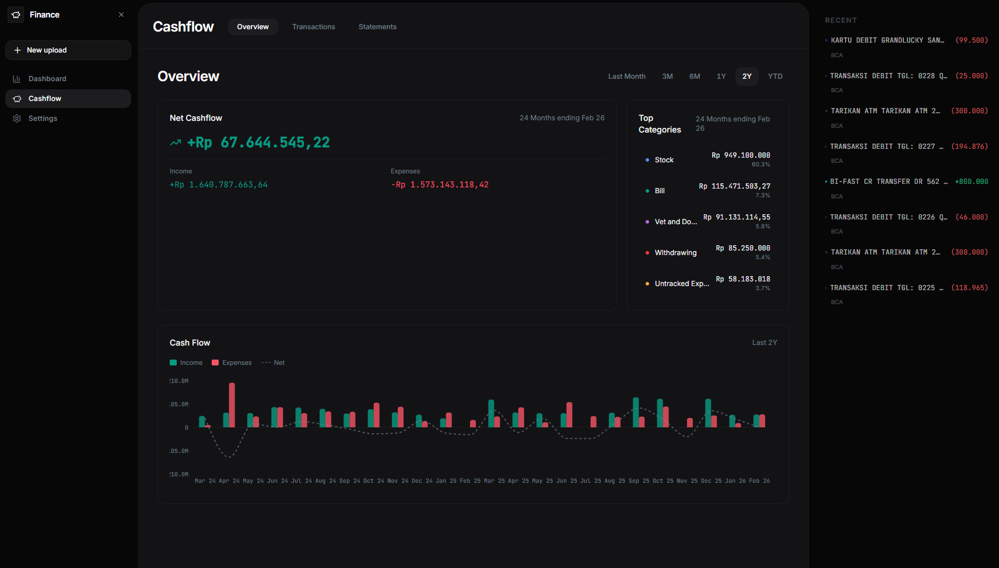
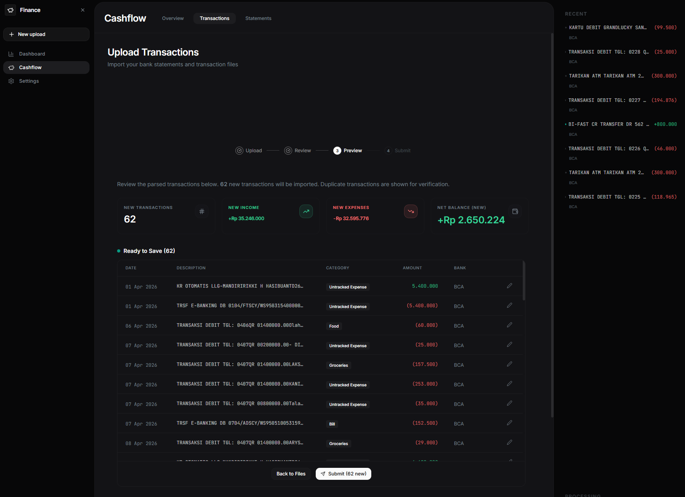
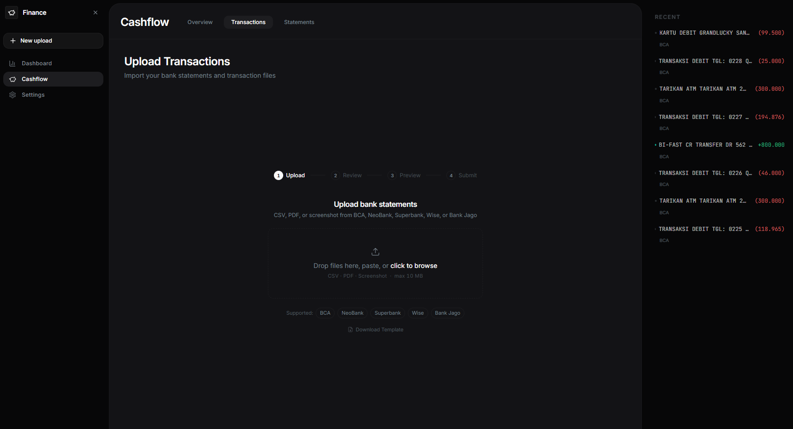
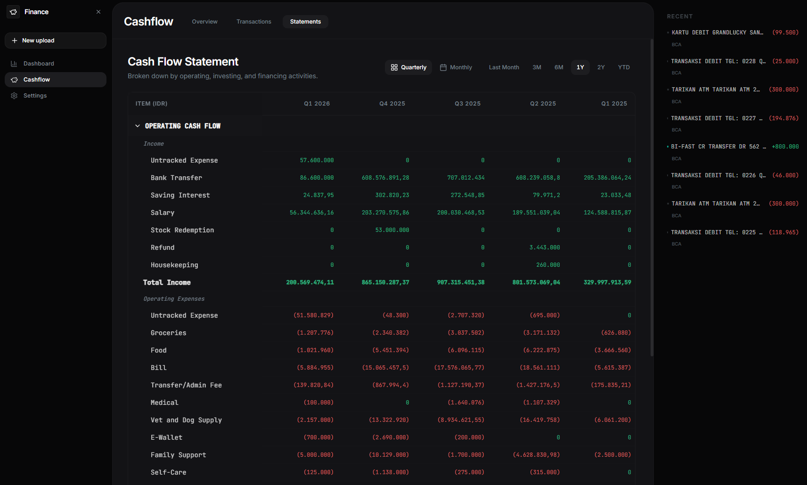
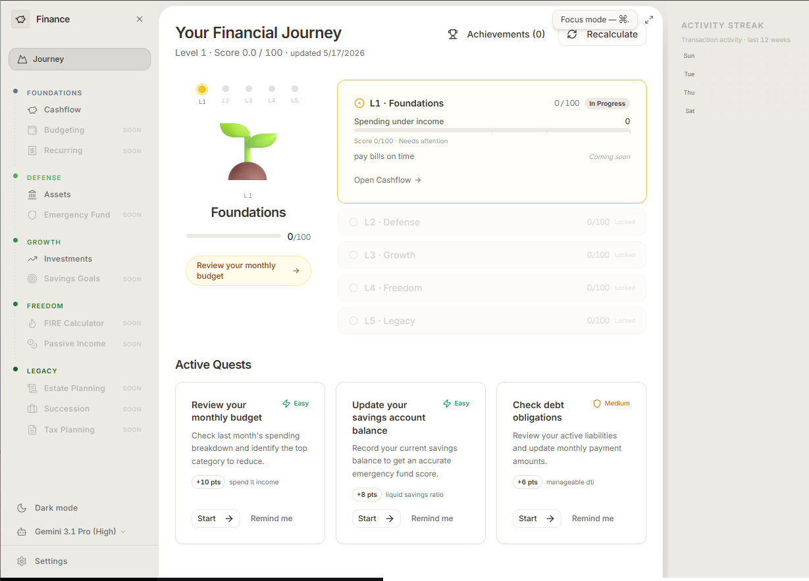

# 💰 Personal Finance Platform

> **Finance should feel like a game you're winning, not a spreadsheet you're losing.**

A self-hosted personal finance platform. The mission: **make managing money genuinely enjoyable** — through clarity, progress, and a sense of level-up. Not another budgeting tool that guilts you. A compass that shows where you stand, what to do next, and celebrates when you move forward.

AI-powered ingestion handles the messy part — getting data out of bank CSVs, PDFs, and screenshots automatically so you spend time on decisions, not data entry.

**Cashflow tracking, assets management, investment portfolio, spending analysis, and financial journey gamification are all live.** Everything else is being built out one level at a time.

## 🧭 Who this is for

Most people aren't financially illiterate — they're **directionally lost**. They know saving is good. They know investing matters. But nobody handed them a map for *in what order* and *how much is enough at each step*.

This app is built for that person. Not the finance nerd with five brokerage accounts. The person who earns a decent salary, vaguely saves, occasionally invests, and still feels like they're not making real progress — because they don't have a framework, not because they lack money.

The Financial Pyramid gives them the framework. The app turns it into a game they can actually win.

## 🤔 The problem this solves

Most people don't have a money problem. They have a **clarity and direction problem.**

They earn, they spend, they occasionally invest — but without a coherent picture of where they stand or a framework for what to do next. Every financial tool they use answers a different slice of the question in isolation: a budgeting app here, a broker app there, a bank statement downloaded once a month that nobody reads. Plenty of data, no map.

The result is a financially active person who still feels stuck. Not because they're doing nothing — but because they don't know if what they're doing is the *right thing at their level*. Someone maxing out their investment portfolio while carrying high-interest debt. Someone diligently saving without knowing whether their emergency fund is adequate. Someone who opened a FIRE calculator before they've ever tracked a month of spending. Good intentions, wrong order.

That's the problem the **Financial Pyramid** is designed to fix. Financial health isn't a checklist — it's a hierarchy. Each level has prerequisites. You can't defend what you haven't yet built. You can't grow what you haven't defended. The pyramid makes the order explicit, so every decision has context: *this is the level you're on, this is what matters here, this is what unlocks next.*

This platform is built around that framework end-to-end. The data infrastructure (automatic ingestion from any Indonesian bank format, unified cashflow + assets + investments in one place) exists to feed the framework — so your pyramid scores reflect reality, not estimates. The gamification layer exists to make progress feel like progress, not just another month of tracking. The whole system points at one question: **not "where did my money go?" but "how far up the pyramid am I, and what's my next move?"**

Let's make finance fun!


## 🏔️ The Backbone: Financial Pyramid

Every feature in this app is anchored to a single framework — the **financial pyramid hierarchy**. Think of it as a compass for your financial life: it tells you where you are, where you're headed, and what to do *right now* at your level — not in ten years.

You can't invest well without a safety net. You can't build a safety net without understanding your cashflow. Skipping levels is how people end up with crypto portfolios and no emergency fund. The pyramid makes the *correct order* explicit, so every decision has context.

```
                 ▲
               ████             L5 · Legacy
                                Estate Planning · Succession · Tax Planning
             ████████           L4 · Freedom
                                FIRE Calculator · Passive Income
           ████████████         L3 · Growth
                                Investments · Savings Goals
         ████████████████       L2 · Defense
                                Assets · Emergency Fund
       ████████████████████     L1 · Foundations
                                Cashflow · Budgeting · Recurring
```

Each level unlocks naturally from the one below. The app tracks your score across all five tiers and surfaces exactly where to focus next — no guessing, no overwhelm, no shame. Just: **here's your level, here's your next quest.**

## 🗺️ The Roadmap (by level)

### L1 · Foundations — *Know where your money goes*

| Feature | Status |
|---|---|
| Cashflow tracking (upload, categorize, review) | ✅ Live |
| Spending analysis (Safe-to-Spend, variance) | ✅ Live |
| RAG — semantic search over transactions | 🔄 In Progress |
| Budgeting (50/30/20, zero-based, envelope) | 🔜 Soon |
| Recurring (bills, subscriptions, due dates) | 🔜 Soon |

### L2 · Defense — *Protect what you have*

| Feature | Status |
|---|---|
| Assets & balance sheet (net worth, liabilities) | ✅ Live |
| Emergency Fund tracker | 🔜 Soon |

### L3 · Growth — *Make money work*

| Feature | Status |
|---|---|
| Investment portfolio (IDX, funds, bonds, crypto, P2P) | ✅ Live |
| Savings Goals | 🔜 Soon |

### L4 · Freedom — *Build passive income*

| Feature | Status |
|---|---|
| FIRE Calculator | 🔜 Soon |
| Passive Income tracker | 🔜 Soon |

### L5 · Legacy — *Leave a mark*

| Feature | Status |
|---|---|
| Estate Planning (hibah, warisan, wills, trusts) | 🔜 Soon |
| Succession (business ownership transfer) | 🔜 Soon |
| Tax Planning (SPT, PTKP, deductibles) | 🔜 Soon |
 
## ✅ What's live now

### Cashflow tracking

Upload bank statements from BCA, Superbank, NeoBank, Wise, or Bank Jago — CSV, PDF, or screenshot — and get a unified transaction history across all accounts.

- Hybrid parser: CSV files parsed directly (fast, zero AI cost); PDFs and screenshots go through Gemini / Claude for structured extraction; Superbank PDF uses bank-specific LLM prompt
- IBankSignature registry (Chain of Responsibility) detects the bank from file content and dispatches to the correct parser — adding a new bank = adding one class
- 4-layer auto-categorization: rule-match (106 rules) → category presets → history cache → LLM fallback (Gemini). Cold-start safe — preset seed covers new users.
- Bulk AI categorization in upload preview — select uncategorized rows and hit ✦ Suggest for batch Gemini classification
- 4-step upload wizard — drag/drop, file picker, or clipboard paste; PDF password support; inline editing before save
- Cashflow workspace: Overview, Transactions table (server-paginated, filterable, CSV export), Cash Flow Statement (quarterly/monthly)
- Three-tier deduplication so nothing gets imported twice

→ **Engineering details:** parser routing, bank detection (IBankSignature chain), validation pipeline, and master schema — [docs/features/cashflow-ingestion.md](docs/features/cashflow-ingestion.md)









### 🏦 Assets management & balance sheet

Track everything you own and owe in one place.

- Asset registry: property, vehicles, savings accounts, cash, valuables, and other assets with current valuations
- Liability tracking: loans, mortgages, BNPL, and other debts
- Live net worth calculation — total assets minus total liabilities, updated as you add or edit entries
- Balance sheet view with categorized breakdown

### 📈 Investment portfolio

Track your full investment picture across Indonesian market instruments.

- Stocks (IDX), mutual funds, government bonds (SBN/ORI), crypto, P2P lending
- Portfolio overview with allocation breakdown and total valuation
- Return tracking per instrument

### 📊 Spending analysis

Understand where your money actually goes.

- Safe-to-Spend indicator — compares income vs committed expenses to show discretionary headroom
- Variance explainer — highlights categories that deviated from the prior period
- Monthly spending breakdown with category drilldown

### 🗺️ Financial Journey

The gamification layer that ties everything together. Progress through the five pyramid levels, earn scores, complete quests.

- Five tiers: **Foundations → Defense → Growth → Freedom → Legacy** — each with 2–3 scored indicators
- Living Garden Hero — 5 animated plants grow as your scores improve; each plant has 4 growth stages tied to your level progress
- No-decay rule — plants never shrink when scores dip (peak stage persisted in localStorage)
- Quest cards with actionable next steps per tier, activity streak heatmap
- The journey page is the home screen — it always shows where you are in the pyramid and what to do next



### 🤖 AI Learning & Evaluation

The platform doubles as the implementation vehicle for a 90-day AI Engineering learning path.

- **Langfuse AI observability** — cost/day, calls/day, p50/p95 latency, and token counts per LLM call; Gemini and Anthropic provider traces visible in Langfuse dashboard (PF-AI001)
- **20-fixture extraction eval harness** — benchmarks Gemini 2.5 Flash vs Claude Sonnet 4.6 on real anonymized bank statement fixtures; row-level F1 + field-level accuracy; results auto-saved to `evals/results/YYYYMMDD.json` (PF-AI002 — Gemini 2.5 Flash 100% row F1 confirmed)
- **RAG pipeline in progress** — pgvector embeddings + semantic search (`POST /embed-transactions` + `POST /search`); re-ranking + `/ask` endpoint to follow (PF-AI003/AI004)

### 🖥️ Platform

- Dark/light theme with zen-mode UX — focus mode toggle, clean minimal interface
- System health dashboard at `/status` — polls all services every 30 seconds
- LGTM observability stack — OpenTelemetry traces, metrics, and logs across .NET API and Python AI service, surfaced in Grafana

 

## 🚀 Getting started

**Prerequisites:** Docker Desktop, Node.js 20+, .NET 10 SDK, Python 3.12+, Supabase CLI

```bash
# 1. Configure environment
cp .env.example .env
# Add GEMINI_API_KEY (or ANTHROPIC_API_KEY) and Supabase keys

cp services/ai-service/.env.example services/ai-service/.env
# Add AI_PROVIDER=gemini and GEMINI_API_KEY

# 2. Start everything
npm start
```

| URL | What |
|---|---|
| http://localhost:8080 | The app |
| http://localhost:8080/journey | Your pyramid progress |
| http://localhost:8080/status | Service health |
| http://localhost:54323 | Supabase Studio |
| http://localhost:3000 | Grafana |

Go to **Cashflow → Upload**, drop in a BCA CSV or any PDF, review the preview, hit Submit.
 

## 🏗️ Architecture

```
┌─────────────────────────────────────────────────────────────────┐
│                     React 18 Frontend                           │
│  ┌──────────────────┐    ┌────────────────────────────────────┐ │
│  │ @supabase/js     │    │ REST calls via fetch()             │ │
│  │  - Auth (login)  │    │  - CRUD, upload, dashboard, etc.  │ │
│  │  - Realtime sub  │    │  - Bearer token from Supabase Auth │ │
│  └────────┬─────────┘    └───────────────┬────────────────────┘ │
└───────────┼──────────────────────────────┼──────────────────────┘
            │ direct                       │ via .NET API
            ▼                              ▼
┌───────────────────────┐   ┌──────────────────────────────────────┐
│   Supabase Platform   │   │        .NET 10 Web API (C#)          │
│                       │   │  Controllers → MediatR (CQRS)        │
│  Auth (GoTrue/JWT)    │   │  FluentValidation                    │
│  Storage (buckets)  ◄─┼───┤  Infrastructure:                     │
│  Realtime (WS)        │   │   - supabase-csharp (PostgREST)      │
│  Database Webhooks ───┼─┐ │   - StorageService (Supabase Storage)│
│                       │ │ │   - CSV Parsers (BCA, Wise, Default) │
│  ┌─────────────────┐  │ │ │   - Validation Pipeline              │
│  │ PostgreSQL 17   │  │ │ └──────────────────────────────────────┘
│  │ + pgvector      │  │ │
│  │ transactions    │  │ │       Webhook POST on INSERT
│  │ category_rules  │  │ │
│  │ statement_      │  │ │  ┌──────────────────────────────────┐
│  │   uploads       │  │ └──►  Python AI Service (FastAPI)     │
│  │ embeddings      │  │      │  1. Download from Storage      │
│  │ (RLS enforced)  │◄─┼──────┤  2. PyMuPDF / Claude Vision    │
│  └─────────────────┘  │      │  3. Claude tool_use extraction  │
│                       │      │  4. Write results via supabase-py│
└───────────────────────┘      └────────────────────────────────┘
```

**Coming next:** Supabase Auth (PF-S08), RAG Phase 1 embeddings + semantic search (PF-AI003), event-driven webhook pipeline replacing synchronous AI calls (PF-S11), Realtime status updates (PF-S12). Full target architecture: [docs/architecture/architecture-diagram.md](docs/architecture/architecture-diagram.md)

| Layer | Technology |
|---|---|
| Frontend | React 18 · Vite · TypeScript · Tailwind CSS · shadcn/ui |
| Backend API | .NET 10 / C# 13 · ASP.NET Core · CQRS via MediatR · Clean Architecture |
| Persistence | Supabase (PostgreSQL 17 + pgvector) via supabase-csharp — no ORM |
| AI Service | Python 3.12 · FastAPI · Gemini 2.5 Flash (primary) · Claude Sonnet 4.6 (alternate) |
| Document parsing | PyMuPDF (pre-LLM PDF extraction) · LLM vision (images) |
| Observability | OpenTelemetry → Alloy → Prometheus + Loki + Tempo → Grafana |
| Containers | Docker Compose V2 |

```
apps/
  frontend/          # React 18 + Vite — api/, components/, pages/, types/
  api/               # .NET 10 Clean Architecture — Api, Application, Domain, Infrastructure
services/
  ai-service/        # Python FastAPI — providers (Gemini, Anthropic), LlmParser, PdfExtractor
supabase/
  migrations/        # SQL migrations
docs/                # Architecture, sprint plan, bank format reference
```

```bash
npm start                                                            # everything
cd apps/frontend && npm run dev                                      # frontend only
cd apps/api && dotnet run --project src/PersonalFinance.Api         # backend only
cd services/ai-service && uvicorn app.main:app --reload --port 8000 # AI service only
npm run e2e                                                          # Playwright E2E
cd apps/api && dotnet test                                           # backend unit tests
```
