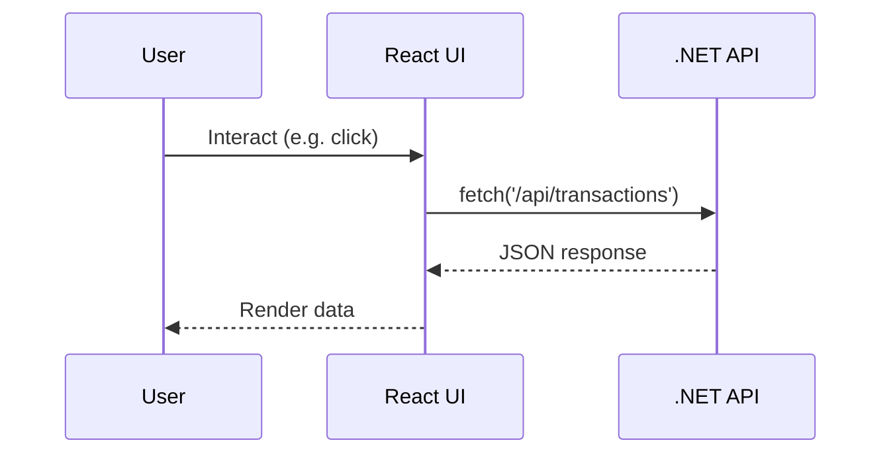

# Stack & App Structure

- **Framework:** React 18, Vite, TypeScript
- **Routing:** `react-router-dom`
- **State:** React state, TanStack React Query
- **Styling:** Tailwind CSS, shadcn/ui, custom tokens

**Directory map:**
```
src/
  api/           # API clients (REST)
  components/    # UI components (atomic, shadcn/ui)
  data/          # Mock/test data
  hooks/         # Custom React hooks
  lib/           # Utilities
  pages/         # Route views
  types/         # TypeScript types
  utils/         # Parsing, helpers
public/          # Static assets
```

# Run & Build

## Dev server
```sh
npm run dev
```

## Build
```sh
npm run build
```

## Preview
```sh
npm run preview
```

- **Env files:** `.env`, `.env.local` (for VITE_ vars)
- **Static assets:** `public/`
- **API proxy:** <!-- TODO: add proxy config if present -->

# Environment Variables

| NAME         | Required | Example                | Notes                |
|--------------|----------|------------------------|----------------------|
| VITE_API_URL | Yes      | http://localhost:7208  | API base URL         |
<!-- TODO: add more as needed -->

# API Integration

- **HTTP:** Native `fetch`, API clients in `src/api/`
- **Error handling:** Throws on non-2xx, handled in UI
- **Types:** DTOs in `src/api/transactionsApi.ts`, `categoryRulesApi.ts`



# UI System

- **Component library:** shadcn/ui, Radix UI
- **Design tokens:** Tailwind config (`tailwind.config.ts`)
- **Icons:** lucide-react
- **Theming:** `next-themes`, Tailwind dark mode

# State Management & Caching

- **React Query:** `@tanstack/react-query` for data fetching/caching
- **Local state:** React hooks

# Auth UX

- **Auth:** <!-- TODO: add login flow if present -->
- **Token storage:** <!-- TODO: add info if present -->
- **Protected routes:** <!-- TODO: add info if present -->

# Testing & Quality

- **Lint:** `npm run lint` (ESLint)
- **Unit/component tests:** <!-- TODO: add test command/config -->
- **E2E:** <!-- TODO: add e2e config if present -->
- **A11y:** <!-- TODO: add accessibility checks -->
- **Performance:** <!-- TODO: add budgets if present -->

# Internationalization/Accessibility

- **i18n:** <!-- TODO: add i18n setup if present -->
- **A11y:** Follows React/Tailwind best practices

# Common Tasks Cookbook

- **Add a page/route:**
  - Add file to `src/pages/`, update router
- **Add a component:**
  - Add to `src/components/`, import as needed
- **Add a data call:**
  - Add function to `src/api/`, use in component
- **Feature flag:** <!-- TODO: add info if present -->

# Troubleshooting

- **API errors:** Check `VITE_API_URL` and API server status
- **CORS:** Ensure API allows `http://localhost:8080`
- **Build fails:** Check Node version, dependencies

# FAQ

- **How do I add a new API call?**
  - Add to `src/api/`, import in component
- **How do I style a component?**
  - Use Tailwind classes or extend `tailwind.config.ts`

# Glossary

- **DTO:** Data Transfer Object
- **React Query:** Data fetching/caching lib
- **shadcn/ui:** Headless React UI kit

# Repo Signals Scanned

- `package.json`
- `vite.config.ts`
- `src/api/transactionsApi.ts`
- `src/api/categoryRulesApi.ts`
- `src/components/`
- `src/pages/`
- `src/hooks/`
- `tailwind.config.ts`
- `postcss.config.js`
- `eslint.config.js`
