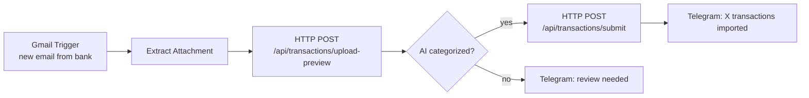
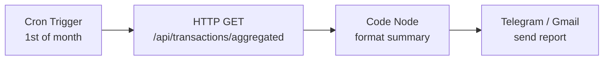
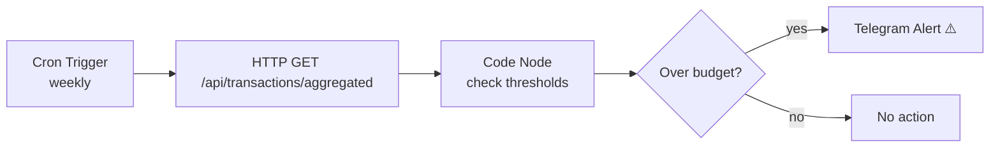
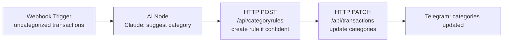
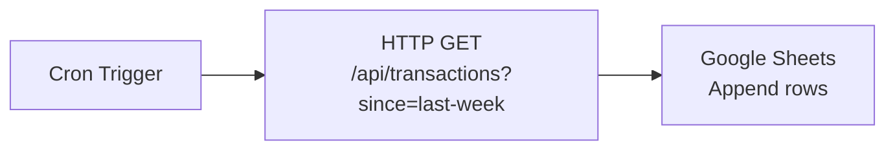

# Overview

This document captures the planned evolution of the Personal Finance project based on current architectural gaps and discussions. The goal is to move from **manual, fragile bank-specific parsers** to an **AI-driven, automated pipeline** that requires minimal human intervention.

---

# Current State (Baseline)

```
User manually downloads PDF/CSV from bank
    → Uploads via React UI
    → .NET API: BcaCsvParser or NeoBankPdfParser (manual regex)
    → CategoryRule keyword matching
    → Saved to PostgreSQL
    → React Dashboard displays data
```

**Known pain points:**
- Parsers break if bank changes CSV layout or PDF format
- Adding a new bank requires writing a new parser class
- No automation — everything is manual
- No authentication on API (unsafe to expose publicly)
- No webhooks — n8n must poll instead of being triggered

---

# Phase 1 — AI-Powered Parser

**Goal:** Replace brittle regex/string parsers with an LLM extractor that works across any bank format.

## 1.1 Design

```
File uploaded (PDF or CSV)
    → PdfPig / StreamReader extracts raw text (unchanged)
    → LlmTransactionExtractor sends text to Claude API
    → Claude returns structured JSON array of transactions
    → Validated & mapped to TransactionDto (unchanged)
    → CategoryRule matching (unchanged)
```

The only new component is `LlmTransactionExtractor` in `PersonalFinance.Infrastructure`.

## 1.2 New Files

| File | Layer | Purpose |
|---|---|---|
| `Infrastructure/Ai/LlmTransactionExtractor.cs` | Infrastructure | Calls Claude API, returns `List<TransactionDto>` |
| `Infrastructure/Ai/ILlmTransactionExtractor.cs` | Infrastructure | Interface for DI |
| `Infrastructure/Ai/LlmParserPrompts.cs` | Infrastructure | Prompt templates |
| `Application/Interfaces/ILlmTransactionExtractor.cs` | Application | Abstraction layer |

## 1.3 Prompt Strategy

Use Claude structured output. Example prompt shape:

```
You are a bank statement parser. Extract all transactions from the text below.
Return a JSON array only. Each item must have:
  - date (ISO 8601)
  - description (string)
  - amount (number, always positive)
  - flow ("CR" for credit/income, "DB" for debit/expense)
  - balance (number or null)

Bank statement text:
---
{rawText}
---
```

## 1.4 Configuration

Add to `appsettings.json`:

```json
{
  "Ai": {
    "Provider": "Anthropic",
    "Model": "claude-sonnet-4-6",
    "ApiKey": "your-key-here",
    "MaxTokens": 4096
  }
}
```

Add to `.env.example`:
```
AI__PROVIDER=Anthropic
AI__MODEL=claude-sonnet-4-6
AI__APIKEY=
```

## 1.5 Parser Selection Logic

Keep existing parsers as fallback. Add a parser mode flag:

| Mode | Behavior |
|---|---|
| `ai` | Use LLM extractor for all files |
| `manual` | Use existing BcaCsvParser / NeoBankPdfParser |
| `auto` (default) | Try manual first, fall back to AI if unrecognized bank |

`BankIdentifier.cs` already returns `null` for unknown banks — use that as the trigger to invoke AI.

## 1.6 Trade-offs

| | Manual (current) | AI |
|---|---|---|
| Cost | Free | ~$0.01–0.05 per statement |
| Speed | <100ms | 2–8s |
| New bank support | New parser required | Works automatically |
| Format change resilience | Breaks | Adapts |
| Accuracy | 100% (known format) | ~95–99% |

## 1.7 Tasks

- [ ] Add `Anthropic.SDK` NuGet package to `PersonalFinance.Infrastructure`
- [ ] Implement `LlmTransactionExtractor`
- [ ] Add `AiParserMode` config option
- [ ] Update `CsvTransactionParser` / upload-preview controller to use mode
- [ ] Write unit tests with recorded LLM responses (snapshot testing)
- [ ] Update `docs/API-backend.md` with new config vars

---

# Phase 2 — API Hardening (Pre-requisite for Automation)

**Goal:** Make the API safe and capable for external access by n8n.

## 2.1 API Key Authentication

Current state: **no auth** — unsafe to expose publicly.

Add a simple API key middleware:
- Header: `X-Api-Key: <key>`
- Store key in `appsettings` / environment variable
- All `/api/*` endpoints protected
- n8n HTTP Request nodes include the header

## 2.2 New Endpoints Needed by n8n

| Endpoint | Purpose |
|---|---|
| `GET /api/transactions?since={datetime}` | Incremental sync — avoid re-fetching all data |
| `POST /api/transactions/upload-preview-url` | Accept a file URL instead of multipart (easier for n8n) |
| `GET /api/health` | Single health check for n8n monitoring |

## 2.3 Webhook Support (Push vs Poll)

Currently n8n must **poll** the API on a schedule. Add webhook support so the API can **push** to n8n when events occur:

| Event | Trigger |
|---|---|
| Transactions imported | After `POST /api/transactions/submit` |
| Uncategorized transactions found | After import if any category = "Untracked Expense" |
| Monthly summary ready | Cron-triggered from API |

Add to `appsettings.json`:
```json
{
  "Webhooks": {
    "TransactionsImported": "https://your-n8n-instance/webhook/transactions-imported",
    "UncategorizedFound": "https://your-n8n-instance/webhook/uncategorized"
  }
}
```

## 2.4 Tasks

- [ ] Add API key middleware to `Program.cs`
- [ ] Add `since` query param to `GET /api/transactions`
- [ ] Add webhook dispatcher service in `Application/Services/`
- [ ] Fire webhooks after submit in `TransactionsController`
- [ ] Update `docs/API-endpoints.md` with auth and new endpoints

---

# Phase 3 — n8n Automation Workflows

**Goal:** Automate the full pipeline from bank email → parsed data → dashboard → alerts.

## 3.1 Workflow: Email → Auto Import

**Trigger:** Gmail — new email from bank with PDF/CSV attachment



**n8n nodes used:** Gmail Trigger, HTTP Request, IF, Telegram

## 3.2 Workflow: Monthly Spending Report

**Trigger:** Cron — 1st of every month at 08:00



**Sample report format:**
```
📊 February 2026 Summary
Total Spent: Rp 4.200.000
Top Category: Food (Rp 1.100.000 — 26%)
Income: Rp 12.500.000
Savings Rate: 66%
```

## 3.3 Workflow: Budget Alert

**Trigger:** Cron — every Monday



Budget thresholds configured in n8n workflow variables (not in API).

## 3.4 Workflow: AI Categorization Review

**Trigger:** Webhook from API — `uncategorized-found` event



## 3.5 Workflow: Google Sheets Sync

**Trigger:** Cron — weekly on Sunday



## 3.6 Tasks

- [ ] Set up n8n instance (local Docker or cloud)
- [ ] Create API key and configure in n8n credentials
- [ ] Build Workflow 3.1 (email auto-import)
- [ ] Build Workflow 3.2 (monthly report)
- [ ] Build Workflow 3.3 (budget alert)
- [ ] Build Workflow 3.4 (AI categorization)
- [ ] Build Workflow 3.5 (Sheets sync)
- [ ] Export n8n workflow JSONs to `docs/n8n-workflows/`

---

# Phase 4 — Go API (Future)

The `api-go/` directory currently contains only a "Hello World" stub. Possible future use:

| Option | Notes |
|---|---|
| Replace .NET API entirely | Only if Go expertise is preferred |
| Dedicated AI parser service | Go calls Claude API, returns DTOs to .NET |
| Lightweight webhook forwarder | Go handles n8n webhook dispatch |

**Decision: defer until Phase 1–3 are complete.**

---

# Full Target Architecture

```
Bank Email (Gmail)
    │
    ▼
┌─────────────────────────────┐
│           n8n               │
│  - Email watcher            │
│  - Cron jobs                │
│  - AI categorization        │
│  - Alerts & reports         │
└─────────┬───────────────────┘
          │ HTTP + API Key
          ▼
┌─────────────────────────────┐
│      .NET API (:7208)        │
│  + API Key Auth             │
│  + Webhook dispatcher       │
│  + LlmTransactionExtractor  │
│  + Incremental ?since=      │
└─────────┬───────────────────┘
          │
    ┌─────┴──────┐
    │            │
    ▼            ▼
PostgreSQL   Claude API
              (Anthropic)
    │
    ▼
┌─────────────────────────────┐
│    React Frontend (:8080)    │
│  Dashboard / Tables / Charts │
└─────────────────────────────┘
```

---

# Execution Order

| Phase | Dependency | Effort |
|---|---|---|
| **1 — AI Parser** | None — self-contained | Medium |
| **2 — API Hardening** | None — parallel with Phase 1 | Small |
| **3 — n8n Workflows** | Needs Phase 2 (auth + new endpoints) | Medium |
| **4 — Go API** | Needs Phase 1–3 complete | TBD |

Recommended start: **Phase 1 and Phase 2 in parallel**, then Phase 3.

---

# Open Questions

- [ ] Which AI provider? Claude (Anthropic) vs OpenAI GPT-4o vs Gemini
- [ ] n8n hosting: self-hosted Docker on same server, or n8n Cloud?
- [ ] What banks need to be supported beyond BCA and NeoBank?
- [ ] Budget thresholds: stored in API DB or in n8n workflow variables?
- [ ] Auth: simple API key sufficient, or need user login (JWT)?
