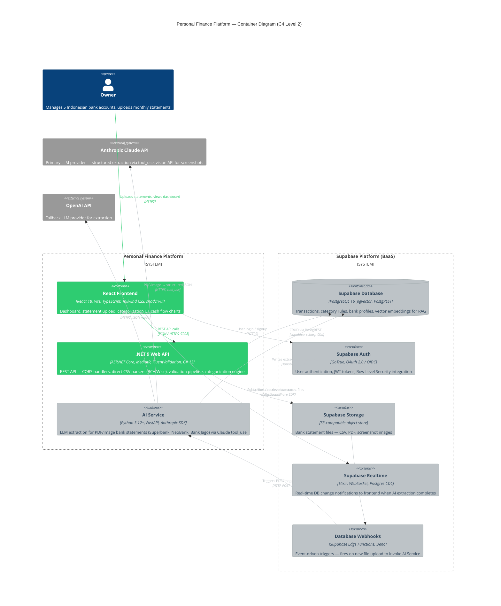

# C4 Container Diagram — Personal Finance Platform (Level 2)

> **Living HLD** — Color-coded by status. Update `$tags` as work completes.
> Last updated: 2026-04-11

## Legend

| Color | Tag | Meaning |
|-------|-----|---------|
| 🟢 Green `#2ecc71` | `done` | Container exists and works today |
| ⬜ Gray `#bdc3c7` | `pending` | Not yet built or migrated |
| ⬛ Dark `#2c3e50` | — | External system |

## Diagram

## Container Status

| # | Container | Tech | Status | Notes |
|---|-----------|------|--------|-------|
| 1 | React Frontend | React 18, Vite, TS, Tailwind | **Done** | Dashboard, upload, categorization all working |
| 2 | .NET 9 Web API | ASP.NET Core, MediatR, EF Core | **Done** | Needs refactor: replace EF Core with `supabase-csharp` SDK |
| 3 | AI Service | Python FastAPI, Anthropic SDK | **Pending** | PF-009 in progress; full service not built |
| 4 | Supabase Database | PostgreSQL 16 + pgvector | **Pending** | Migrate schema via `dotnet ef migrations script` → paste to Supabase SQL editor |
| 5 | Supabase Auth | GoTrue, OAuth 2.0 | **Pending** | Replaces deferred Auth0 plan |
| 6 | Supabase Storage | S3-compatible | **Pending** | Replaces local file handling in upload pipeline |
| 7 | Supabase Realtime | WebSocket, Postgres CDC | **Pending** | Eliminates polling after AI extraction |
| 8 | Database Webhooks | Edge Functions, Deno | **Pending** | Event-driven AI trigger; replaces sync .NET → Python HTTP call |

## How to Update This Diagram

When a container is complete, move its `UpdateElementStyle` from the `%% pending elements styling` section to the `%% done elements styling` section, and flip its relationship line colors from `#bdc3c7` to `#2ecc71`.
