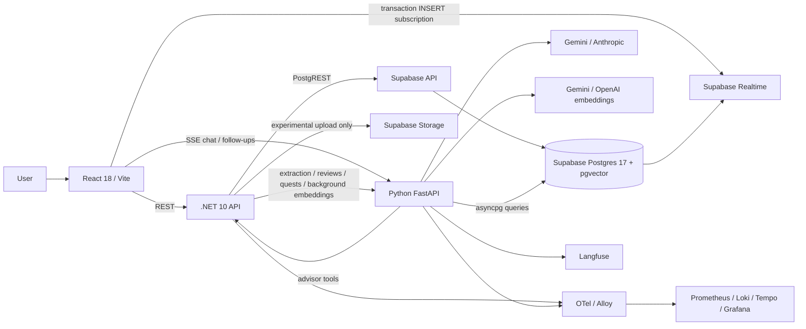

# C4 Container View — Current Implementation

> **Reviewed:** 2026-10-08. Implemented source relationships; no runtime/deployment verification in this sync.

```mermaid
flowchart LR
    User[User] --> UI[React 18 / Vite]
    UI -->|REST| API[.NET 10 API]
    UI -->|SSE chat / follow-ups| AI[Python FastAPI]
    UI -->|transaction INSERT subscription| RT[Supabase Realtime]
    API -->|PostgREST| SB[Supabase API]
    SB --> DB[(Supabase Postgres 17 + pgvector)]
    API -->|experimental upload only| ST[Supabase Storage]
    API -->|extraction / reviews / quests / background embeddings| AI
    AI -->|advisor tools| API
    AI -->|asyncpg queries| DB
    AI --> LLM[Gemini / Anthropic]
    AI --> EMB[Gemini / OpenAI embeddings]
    DB --> RT
    API --> OT[OTel / Alloy]
    AI --> OT
    OT --> LGTM[Prometheus / Loki / Tempo / Grafana]
    AI --> LF[Langfuse]
```

| Container / capability | Code status | Boundary |
|---|---|---|
| Frontend | Implemented | Journey/Cashflow/Assets/Investment/Chat/Desk/Lab/Settings; no login flow |
| .NET API | Implemented, net10.0 | Services + MediatR + Supabase; no EF persistence or JWT authentication registration |
| FastAPI | Implemented | Extraction, categorization, RAG/SSE, follow-ups and two separate agent endpoints |
| Supabase database | SQL migrations + SDK integration implemented | Actual applied migrations not checked today |
| Storage | Bucket and client implemented | Standard upload does not use it; async PDF/image stub cannot finish |
| Realtime | Transaction INSERT subscription implemented | Upload-status realtime remains pending |
| Supabase Auth integration | Planned | Platform service availability does not imply app authentication |
| Database webhook extraction | Planned | No statement_uploads schema or Python webhook route |
| Standalone Compose Postgres 16 | Still configured | Separate database on 5432, not Supabase database on 54322 |
| OTel/LGTM/Langfuse | Instrumentation/configuration implemented | Collector/dashboard health not checked today |

Dockerfiles exist; current Compose does not configure a complete Supabase-based deployment. See [setup](../SETUP.md) and the [detailed architecture](architecture-diagram.md).
